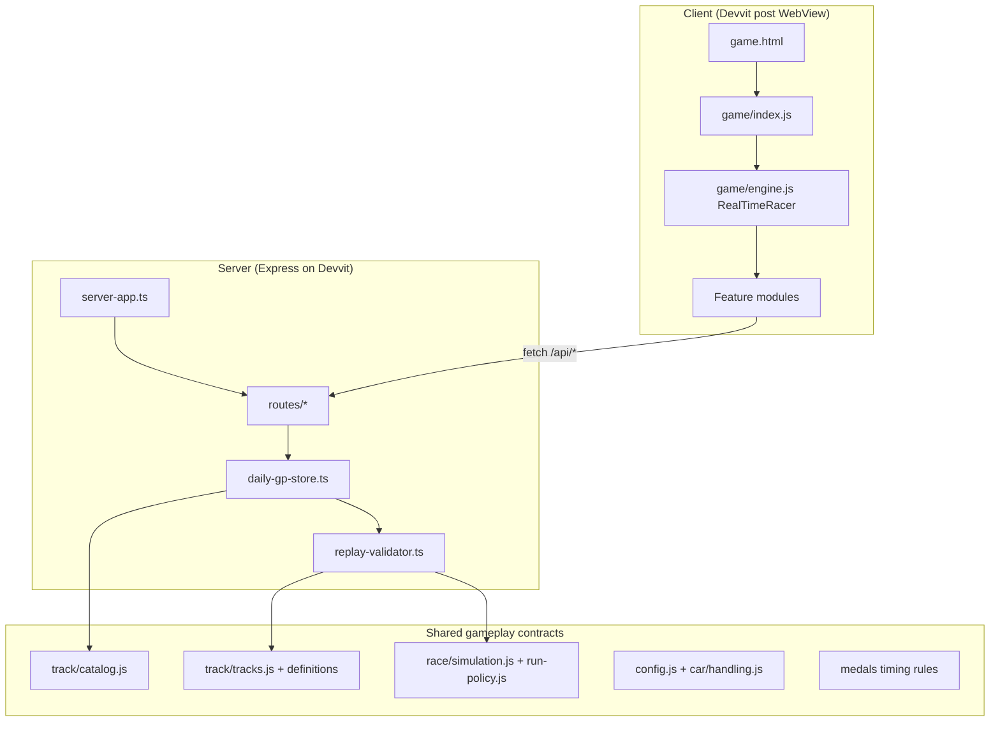

# Modularization Findings

**Date:** 2026-07-21  
**Scope:** `game/`, `src/server/`, shared gameplay contracts (ignore `.stryker-tmp`, `node_modules`, `dist`)  
**Goal:** Smallest changes that give the biggest gains in modularization and separation of concerns

Related: [system-change-map.md](./system-change-map.md) (what owns what today).

---

## Verdict

Do **not** rebuild the architecture.

Feature folders and the “plug methods onto the engine” pattern already work. The main problem is a few oversized files that mix several jobs. Highest payoff is **splitting those files along seams that already exist**, not inventing a new framework.

---

## Current Architecture Snapshot

### How the game boots

1. `game.html` — DOM shell (canvases, HUD, modals, menus)
2. `game/index.js` — boots the app (~58 lines; mostly mobile viewport guards, then `new RealTimeRacer()`)
3. `game/engine.js` — creates `RealTimeRacer`, wires UI objects, audio, ghosts, journeys
4. Behavior is mixed onto the engine with:

```js
Object.assign(
  RealTimeRacer.prototype,
  trackEngineMethods,
  raceEngineMethods,
  dailyChallengeEngineMethods,
  scoreboardEngineMethods
);
```

### What is already clean

| Area | Why it is healthy |
| --- | --- |
| Feature folders | `race/`, `daily-challenge/`, `track/`, `scoreboard/`, `settings/`, `ghost/`, `audio/`, `ui/`, plus `journeys/`, `medals/`, `car/`, `player/`, `shared/` |
| Pure simulation | `game/race/simulation.js` — no DOM / network |
| Pure / mostly pure race helpers | `game/race/run-policy.js` (pure); `game/race/result-flow.js` (builders + one async scoreboard-refresh scheduler — no DOM/network imports) |
| Track metadata vs geometry | `catalog.js` vs `tracks.js` + `definitions/` |
| Scoreboard I/O vs verify | Thin `scoreboard/service.js` uses `api-client.js`; `verification-queue.js` + daily-challenge I/O are orchestrated by `scoreboard/engine-methods.js` (~495 lines — orchestration, not a thin wrapper) |
| Server route DI | `src/server/server-app.ts` injects store functions into `routes/*` |
| Import graph | No circular imports found; server imports from `game/`, never the reverse |

### What is tangled

| Concern | Where it mixes | Problem |
| --- | --- | --- |
| Daily challenge | `daily-challenge/{service,storage,ui,engine-methods}.js` + server store/model | Activation, finish, verify, ghost, lobby, share, and UI share one fat surface |
| UI modals | `race/ui-modal-shell.js` (+ content / handoff helpers) | Shell knows menus, leaderboard, share, garage, settings — not just open/close |
| Identity + API | `scoreboard/api-client.js` (~121 lines) | Player ID / guest token live next to every `/api` route table; most callers import both together |
| Server Redis facade | `daily-gp-store.ts` | Challenge ledger, player prefs, snapshot, and submit/lock in one file |
| Medals | `medals/medals.js` | Timing rules mixed with SVG / overlay presentation; server already imports `getMedalForLapTime` from this mixed module (pulls `medal-icon.js`) |
| Engine `this` | All `*-engine-methods.js` | Runtime god-object: any mixin can reach any other via `this` |

### Size hotspots (approx. lines)

| File | ~LOC | Role |
| --- | --- | --- |
| `game/race/ui-modal-shell.js` | 2077 | Modal FSM + panels + keyboard |
| `src/server/daily-gp-store.ts` | 1754 | Redis competition / player / submit |
| `game/daily-challenge/engine-methods.js` | 1312 | Win / PB ghost / lobby orchestration |
| `game/daily-challenge/service.js` | 1054 | Network + cache + labels |
| `game/race/engine-methods.js` | 879 | Loop / update / render |
| `game/engine.js` | 581 | Composition root |

Nearby large files (not top split priority, but easy to miss): `ui-modal-content.js` (~847), `scoreboard/ui.js` (~831), `simulation.js` (~829 — leave alone), `medals.js` (~733), audio modules (~644 / ~587).

---

## Layers At A Glance



**Rule to protect:** shared physics/track modules may be imported by the server. UI/DOM modules must never be. Medals timing is the soft spot today — rules live in a module that also owns SVG overlays.

---

## Recommended Moves (ranked by leverage)

### 1. Split daily-challenge service: labels vs network/cache

**Files:** `game/daily-challenge/service.js`  
**Effort:** S–M · **Risk:** Low

**Today:** One module owns HTTP, localStorage caches, and pure label/copy helpers (`formatDailyChallenge*`, `getDailyChallengeCopyLabels`, card status; modifier-badge helpers exist but currently return empty stubs).

**Change:**
- Move formatters / copy / badges into e.g. `game/daily-challenge/labels.js` (or `copy.js`)
- Leave fetch, playlist/snapshot/submit/share, and caches in `service.js` (optionally later `api.js` + `cache.js`)

**Benefit:** UI and engine methods can use wording helpers without pulling network/storage. Clearest small win.

**Success:** Label helpers have no `fetch` / `localStorage`; importers of labels no longer need the full service for copy-only use.

---

### 2. Split modal shell by panel / concern

**Files:** `game/race/ui-modal-shell.js`, existing `ui-modal-content.js`, `game/ui/menu-keyboard-nav.js`  
**Effort:** M · **Risk:** Medium (focus / keyboard traps)

**Today:** Largest client file; owns open/close plus leaderboard swipe/paging, share panel, garage nav, settings/tracks/standings keyboard behavior.

**Change:**
- Keep `ModalShell` as a thin facade (open, close, focus, pause handoff)
- Move each panel into sibling modules under `game/race/` or `game/ui/modal/`
- Extend the existing shell vs content split rather than inventing a new UI framework

**Benefit:** Menu bugs stop touching race-loop code. Review surface shrinks for UI work.

**Success:** Shell file no longer contains leaderboard paging / share / garage implementation details; `game.html` DOM IDs stay the contract.

---

### 3. Carve daily-challenge engine-methods into mixin slices

**Files:** `game/daily-challenge/engine-methods.js`  
**Effort:** M · **Risk:** Medium–High (finish / verify path)

**Today:** One mixin blob (**35** public methods) covering PB-ghost, lobby/prewarm, finish/win, HUD sync, apply/create/restart, and playlist modal orchestration.

**Natural clusters (keep the same public mixin API):**
1. PB ghost — `markTrackPersonalBest*` … `applyVerifiedTrackPersonalBest`
2. Lobby / prewarm — `setDailyChallengeLobbySummary`, playlist prewarm
3. Finish path — `handleDailyChallengeWin`, `clearDailyChallengeRun`, lap/invalid handlers
4. HUD sync — `updateDailyChallengeHud`, `syncChallengeHudPrimaryStats`, progress/title helpers
5. Run apply / create / restart — `applyDailyChallenge`, `createDailyChallengeRun`, `restartDailyChallenge`
6. Playlist modal orchestration — `prefetchDailyChallengePlaylist`, paint/prewarm wait helpers

**Change:** Split into several files (start with 1–3 if shipping incrementally); re-export one `dailyChallengeEngineMethods` object so `engine.js` barely changes. Expect a leftover fourth blob if only the first three clusters are extracted.

**Benefit:** Hardest gameplay+persistence+UI path becomes reviewable and testable in pieces.

**Success:** Same `Object.assign` surface; finish/verify behavior unchanged under existing tests.

---

### 4. Split server `daily-gp-store.ts` by existing export domains

**Files:** `src/server/daily-gp-store.ts`, callers in `routes/*`, `server-app.ts`  
**Effort:** M · **Risk:** Medium (Redis keys / TTLs)

**Today:** ~1754-line Redis facade. Exports already group by duty.

**Suggested file split (same function names):**
1. Challenge / playlist
2. Player bootstrap / prefs / identity
3. Snapshot read
4. Submit + lock + leaderboard write (calls replay validator + PB ghost store)
5. Parsers / normalizers (optional shared module)

**Change:** File-split only; preserve DI injection of named functions into routes. PB is already partly in `pb-ghost-store.ts`.

**Benefit:** Prefs changes no longer sit next to submit concurrency/locks. Smaller review blast radius.

**Success:** HTTP routes and Redis key behavior unchanged; tests for store waves still pass.

---

### 5. Split `api-client.js` into identity vs API routes

**Files:** `game/scoreboard/api-client.js`  
**Effort:** S · **Risk:** Low

**Today:** Small mixed hub (~121 lines) — owns player ID / guest token **and** the `/api` URL table. There is no shared `fetchJson` helper yet; callers do their own `fetch`. Most call sites (`storage.js`, `preferences.js`, daily-challenge service, PB ghost service, settings UI, scoreboard service) import identity **and** `API_ROUTES` together today.

**Change:**
1. `player-identity` (or similar) — localStorage player id + guest token
2. `api-routes` + thin `fetchJson` helper (new)

**Benefit:** “Who is the player?” stops looking like “leaderboard networking.” Future call sites can import only what they need.

**Success:** Identity consumers do not import route tables; HTTP consumers do not own token rotation logic.

---

### 6. Formalize the shared gameplay contract (and split medals timing)

**Effort:** S–M · **Risk:** Low (timing extract) / Very low (docs)

**Treat as server-safe package surface (document / enforce):**
- `game/track/catalog.js`, `runtime.js`, `tracks.js` (+ definitions)
- `game/race/simulation.js`, `run-policy.js`
- `game/config.js` physics subset (server already imports `CONFIG`); `game/car/handling.js` (client simulation today — keep server-safe if ever shared)
- `game/shared/checkpoint-times.js`, `leaderboard-identity.js`, `daily-gp-history-backfill.js`
- Medals **timing** rules + `medal-times.json` (not SVG overlays)

**Today’s soft spot:** `src/server/daily-gp-share.ts` imports `getMedalForLapTime` from `game/medals/medals.js`, which also imports SVG/`document` helpers via `medal-icon.js`. Timing functions themselves are pure, but the module boundary is not. `reddit-post-title.ts` already imports `medal-times.json` directly — prefer that pattern after a rules-only extract.

**Benefit:** Stops accidental UI/DOM imports into validation; clarifies change blast radius for physics/track edits. Medals split is more urgent than a pure docs pass.

Optional later: thin `shared/` re-export barrel — only if it reduces confusion, not as a big move.

---

## Suggested Follow-Ons (after the top moves)

| Move | Notes |
| --- | --- |
| Split `race/engine-methods.js` render vs lifecycle | Extract Path2D / `render` (+ camera look-ahead) to `race/render.js` or `engine-render-methods.js`; leave `loop` / `update` / `reset` alone. Do **not** touch `simulation.js`. |
| Thin engine via explicit ports | Pass small objects (`{ getChallenge, getRun, journeys, pbGhost, ui }`) into daily/scoreboard flows instead of growing `this.*` soup. Start with verification queue + share preview/confirm. |
| Medals: rules vs presentation | Extract `getMedalForLapTime` / thresholds into a DOM-free module for server/tools; keep SVG overlays and `medal-icon.js` client-only. Prefer this over leaving share/title on the mixed file. |
| Storage policy module | One place listing keys + read/write policy for guest vs signed-in vs challenge caches — without merging Redis and localStorage. |

---

## What Not To Do

| Expensive move | Why weak payoff |
| --- | --- |
| Replace mixin / `RealTimeRacer` with ECS, full DI, or deep inheritance | Composition root works; pain is file size, not the pattern |
| Big-bang clean-architecture layers across `game/` | Thrash finish/verify/share for little player value |
| Further split `simulation.js` or track `definitions/` | Already well separated; must stay aligned with `replay-validator.ts` |
| Multi-scene framework rewrite of boot | `index.js` + engine constructor is fine |
| Circular-dependency tooling as a priority | Graph already has zero cycles; real issue is fat `this` surface |
| Aggressively sharing runtime modules client↔server beyond pure contracts | Current one-way `server → game` imports are enough |

---

## Patterns To Extend (do not invent new ones)

1. **`*-engine-methods.js` + `Object.assign` onto `RealTimeRacer`** — split *into* this pattern, not away from it.
2. **UI objects with injected callbacks** — `ModalShell`, `SettingsUi`, `LeaderboardsUi`, `RaceHud`, `DailyChallengeUi`, plus `GarageUi` / overlays / loading constructed in `engine.js`; UI should not import the engine class.
3. **Pure gameplay / data modules** — simulation, result-flow, run-policy, catalog, scoreboard snapshot, `daily-gp-model.ts`.
4. **Thin persistence modules** — `daily-challenge/storage.js`, `game/storage.js`, `settings/*-preference.js`, `last-lap-medal-storage.js`.
5. **Scoreboard pipeline** — thin service owns HTTP snapshot I/O; mixin owns verification-queue orchestration (and currently also daily-challenge submit paths).
6. **Server route registration with injected deps** — preserve when splitting the store.

---

## Practical Execution Order

If only a few steps get done, do them in this order:

1. Labels out of `daily-challenge/service.js`
2. Identity out of `api-client.js`
3. Modal shell by panel
4. Daily-challenge engine-methods clusters (expect HUD / apply-run / playlist leftovers if only finish/ghost/lobby ship first)
5. Server `daily-gp-store` by duty
6. Extract medals timing from SVG overlays, then document shared server-safe imports

Each step should be shippable alone with existing tests green.

---

## Integration Risks To Keep In Mind

1. **Single runtime god object** — after `Object.assign`, any feature can reach any other via `this`.
2. **`daily-gp-store.ts` SPOF** — prefs edits next to submit locks are easy to break together.
3. **Physics shared by import path, not package** — changing `config.js` can affect validator and visuals in one edit.
4. **`tracks.js` mega-registry** — ~58 definition modules load with geometry consumers; file itself is small (~128 lines). `catalog.js` helps metadata-only cases.
5. **`game.html` DOM contract** — modal refactors are always HTML + JS (+ CSS) triples.
6. **Medals module boundary** — server share path imports timing through a client presentation module.

---

## Assumptions

- Static import analysis understates modal/engine coupling (`window`, DOM IDs, callbacks).
- [system-change-map.md](./system-change-map.md) remains the product ownership map; this doc is about **modularity seams**.
- Keep the one-way dependency: server may import pure `game/` modules; `game/` must not import `src/server`.
