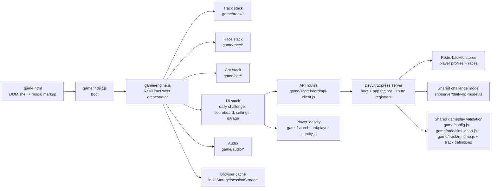

# Mini Racer System Change Map

## Purpose

This file is the fastest way to answer three product questions before a change starts:

1. What part of the product owns this behavior?
2. What else will this change affect?
3. Which files usually need to be touched?

## Scope And Assumptions

- This map covers the shipped game flow in `game.html`, `game/`, and `src/server/`.
- It also calls out supporting tools under `tools/` when they matter to content operations.
- It is written for planning and scoping, not as a line-by-line engineering spec.
- Shared gameplay logic matters more than folder ownership. Several "frontend" changes also affect server validation.
- For modularization seams and recommended file splits, see [modularization-findings.md](./modularization-findings.md).
- For the investigated multi-lap Daily GP and permanent Campaign design, see
  [multi-lap-campaign-architecture.md](./multi-lap-campaign-architecture.md).

## System At A Glance

## What Talks To What

### Boot And Runtime Ownership

- `game.html` provides the full DOM contract: canvases, HUD, overlays, settings modal, garage modal, results modal, and playlist modal.
- `game/index.js` boots the app and instantiates `RealTimeRacer`.
- `game/ui/visible-viewport.js` converts the embedded browser's
  `window.visualViewport.height` into the shared `--app-visible-height`
  layout metric, with `innerHeight` and CSS viewport-unit fallbacks. This keeps
  the full-screen shell inside the actually visible Reddit WebView even when
  native app chrome does not reduce `dvh`.
- `game/engine.js` is the top-level orchestrator. It creates the feature modules, owns current run state, and wires together UI, simulation, track rendering, audio, storage, and network flows.
- The static track and the moving car share one opaque canvas (`#gameCanvas`), drawn on the main thread: `render()` blits the visible track slice through `game/track/layer.js` before it transforms for the world. The earlier second canvas — and the worker/OffscreenCanvas renderer behind it — are gone. The worker never presented reliably inside Devvit's Android WebView (the car appeared over a blank white background), and the extra layer forced the game canvas to stay `alpha: true`, costing a full-viewport composite every frame while saving no drawing, because the track was redrawn each frame either way.

### Gameplay Loop

- `game/race/simulation.js` updates the car position, speed, steering response, checkpoint progress, finish detection, and wall-impact response. The car uses an oriented capsule collision body covering its nose, center, and rear; impact speed comes from velocity at the body contact point, including rotation. Every inward wall impact resolves the full corner contact set to the safe side of the barrier and becomes a momentum-losing scrape, including severe head-on impacts. Continuous contact cannot retrigger scrape feedback until the car separates.
- `game/race/engine-methods.js` is the gameplay controller layer around simulation: start sequence, reset logic, timer flow, replay recording, checkpoint handling, and render-side helpers.
- `game/race/replay.js` records steering and relaunch-delay inputs into run-length segments for scoreboard submission. Legacy revision-0 challenges retain the 3,000-frame cap; revision-1 races use 2,500 frames per required lap (up to 7,500), bind the payload to rules revision and target lap count, and discard the whole payload on overflow.
- `game/ghost/pb-ghost.js` is the isolated client playback/rendering feature. It decodes the server-issued schema-v2 trace once, reconstructs its fixed 20 Hz timeline plus exact finish pose, interpolates it for rendering, freezes the selected ghost for the duration of an attempt, and draws a highly transparent collisionless copy of the player's currently selected car before the player car. `game/ghost/pb-ghost-service.js` owns the authenticated summary/full-ghost requests and cache.
- `game/track/geometry.js` owns the small point and line-intersection helpers shared by track definitions and race simulation. Physics code does not import these helpers through the broader game configuration.
- `game/track/catalog.js` is the lightweight source for track names, existence checks, the default track, and explicit Daily GP schedule order. Metadata-only consumers should use it instead of loading full track geometry.
- `game/track/definitions/*` contains one geometry module per track. `game/track/tracks.js` assembles those modules into the compatibility `TRACKS` registry used by rendering, collision, replay validation, and other geometry consumers.
- `game/track/runtime.js` turns track shapes into smoothed geometry and collision segments.
- `game/track/assets.js` caches geometry, runtime collision data, and rendered track canvases.
- `game/track/engine-methods.js` owns track loading, resize behavior, and track presentation refresh.
- Track creation and integration steps are documented in `docs/track-authoring.md`.
- Developer tooling is removed at build time, not gated at runtime. `tools/debug-module-stubs.js` lists each developer-only module, and `vite.config.js` resolves every one of them to a no-op `.stub.js` for the client build, so none of that code reaches `dist/client`. A runtime check could not do this: the client is in the player's hands, so a hostname or storage gate can be spoofed by serving or patching the bundle, and a minifier will not drop an unreferenced class method. This is why the hooks live in their own modules rather than on the engine class. `tests/debug-module-stubs.test.js` fails if a stub stops covering its module's exports or if engine/launcher code assigns a debug global directly.
- Local development exposes the deterministic gameplay state and time-step helpers through `window.__RACER_DEBUG__` plus the standard `render_game_to_text` / `advanceTime` browser-game test contract, from `game/debug/test-hooks.js`; the launcher posts expose their own smaller contract from `game/debug/launcher-hooks.js`. Loopback hosts and `.local` development aliases are treated as local.
- Local builds enable PB ghost sizing automatically; `?debugPbGhostSize=1` or `window.__PB_GHOST_SIZE_DEBUG__.enable()` also enables it on any unbundled game URL. `game/ghost/pb-ghost-size-debug.js` mirrors the schema-v2 pose recorder, writes JSON byte counts to browser storage synchronously at finish, fills gzip/base64 Redis-envelope fields asynchronously using the native stream API or a portable gzip fallback, reloads prior reports into the next debug session, keeps the last ten complete reports in browser storage, and exposes them through developer-only hooks. It remains browser-local and does not change submission or Redis persistence.

### Devvit Journeys

- `game/journeys/service.js` is the only client adapter for Reddit's official Devvit Journeys API. It serializes lifecycle calls, suppresses duplicate or non-increasing events, reports receipts only to the developer console, and contains SDK failures so they cannot affect loading, racing, finishing, or score submission.
- The startup coordinator reveals the selected mode's lobby after that mode's contract and track are ready. Start input remains gated until those are ready; `App.Ready` is reported once that lobby is visible. Each explicit player intent starts one Journey attempt (`initial_start`, `track_switch`, `restart`, `retry`, or `improve`); checkpoints provide monotonic progress, pause/resume use fixed interaction names, locally validated finishes end complete, and rejected finishes, explicit exits, or track switches end incomplete before the next start. Mid-run track switches replace the active Journey through `replaceActive` end-then-start sequencing. Automatic collision restart stays inside the active Journey because it is not an explicit player action.
- `game/ui/loader.js` owns the status line and retry. The bar crawl lives in `styles/loading.css` and is not tied to startup phase percents. Dismissal removes the input-blocking class immediately and uses the shared 160ms motion token, without depending on animation frames that a hidden WebView may suspend.
- Journey payloads contain no player ID, Reddit username, guest token, challenge ID, track key, replay, device details, or lap score. The official `/api/telemetry` router enriches Journey events in Devvit. Separate moderator summary counters live in the restored `dailygp:analytics:{date}:*` Redis keys for 45 days and are read only through `/api/analytics/summary`.

### UI And Modal Flow

- `game.html` contains the modal markup and the IDs/classes the UI modules depend on.
- `styles.css` is the single ordered stylesheet manifest loaded by the game. Its
  product-oriented partials cover gameplay screens, reusable sheets, garage,
  settings, playlist, standings and result states; their ownership and
  cascade-preservation rules are documented in `docs/css-architecture.md`.
- `game/race/ui-modal-shell.js` controls which modal view is open, focus trapping, pause/win/notice mode switching, and modal-to-garage handoff. Wall contact no longer has a terminal result screen. Active menus use shared spatial keyboard navigation; the `is-menu-selected` cue appears only after a directional key, while Enter activates the preferred modal action and is consumed when no modal action is available.
- `game/race/ui-start-overlay.js` owns the lobby start overlay and uses the same spatial keyboard navigation while no sheet is open on top. Enter defaults to Start Race without a visible cue until a directional key is used.
- `game/ui/menu-keyboard-nav.js` is the shared geometry-based menu navigator used by lobby, pause, finish, garage, settings, Tracks, Standings, and the share dialog. Arrow keys and WASD move to the nearest active control in the requested on-screen direction; overlapping control bounds keep wide actions reachable from narrower menu items. Home uses that navigator on the mode list. The `is-menu-selected` cue is the same 2px white ring used on Start Race and the rest of the menus, drawn on the control itself so it follows that control's existing pill. Daily and Campaign walk header icons, the Daily/Campaign switch, the track picker, and Start Race as rows: up/down moves between those rows, left/right moves within the header or switch, and left/right still changes the picker when nothing is cued, when the picker row is current, or when Start Race is current, including while that action is locked. Standings keeps its date-rail underline and rounded-row visual language for keyboard selection instead of adding browser focus rings. Garage and Settings dismiss buttons are intentionally excluded because Escape owns dismissal, and Settings exposes the delay minus/plus buttons instead of selecting the meter display.
- `game/race/ui-modal-content.js` builds the result modal content blocks and score displays.
- `game/ui/reusable-modal.js` and `game/ui/modal-handoff.js` provide shared modal behavior used by settings, garage, playlist, and some results flows. Reusable modals close an active `[data-nested-modal]` before closing their parent, which lets the Garage unlock-requirement panel share the compact result/share panel language with correct Escape behavior.

### Daily Challenge And Leaderboard Flow

- `game/daily-challenge/service.js` fetches the active challenge, playlist, snapshots, and daily result submission state. Preview/mockDaily fallbacks, active-cache normalization, and share-adjacent client helpers are covered in `tests/daily-challenge.test.js`.
- `game/storage.js` fetches player bootstrap state and falls back to local data when needed. Payload coercion, local short-circuit, hosted failure fallback, and the launch **Retry Sync** / **Continue Offline** prompt are covered in `tests/player-bootstrap-recovery.test.js` and `tests/server-sync-failure-startup.test.js`.
- A bootstrap answer is either authoritative or a fallback, and only an authoritative one may act on the account. Launch identity failure now pauses on **Server synchronization failed**: **Retry Sync** repeats bootstrap, **Continue Offline** takes the last confirmed profile. One shared identity chase (`game/player/identity-recovery.js`) then retries immediately in the background, again when a Daily or Campaign personal best is queued, and later at 30s and 2m plus reconnect or foreground resume. A hosted outage presents the last confirmed profile for that owner from `game/player/profile-cache.js` — never the all-locked default — and applies no default locks, no selected-car rewrite, and no preference save, because a resulting stock selection would survive the outage. The cache holds the last three owners' normalized preference and unlock snapshots and never a guest token.
- Queued results belong to the account that raced them. `game/player/active-owner.js` holds the owner the server named for this session, `game/scoreboard/verification-queue.js` stores entries per owner, and only the current owner's entries are processed or displayed — another account's wait for it to return, so both accounts can hold a queued result for the same race. A result finished before the bootstrap answered is stamped with who this phone already is (`readLastConfirmedProfileOwnerId`, else this phone's guest id) and never dropped. This visit's bootstrap may attach a first-time guest run; a later Reddit sign-in does not take another owner's waiting run. Daily and Campaign submissions carry `submissionOwnerId`, and the server refuses a mismatch with `409 submission_identity_changed` before rate limiting or replay validation, so a paused result keeps its replay and burns no attempts.
- Reddit sign-in now pauses for an explicit progress choice whenever a guest credential is present. The player chooses **Use Guest Progress** (replace the account state) or **Use Saved Progress** / **Start Fresh** (discard the guest state); there is no automatic best-of merge. `src/server/routes/player-routes.ts` exposes the idempotent selection request, while `src/server/daily-gp-store.ts` coordinates Daily, Campaign, and car-unlock replacement before retiring the guest. Player and Campaign bootstrap remain non-authoritative until the choice completes.
- Campaign lobby unlocks and the finish-sheet **Next** action read verified server progress only. Pending verification may still paint the stage time on the sheet, but **Next** stays disabled until the server accepts the run, then the same sheet turns **Next** on and restores its click action. `startCampaignStage` refuses to stamp the next race when confirmation times out or fails.
- Mode runtimes load in the background for prefetch, but only the active launch mode's methods stay installed on `RealTimeRacer.prototype`. `game/modes/runtime-loader.js` re-applies the active mode after warming another mode so Daily overrides are not replaced by shared `challenge-run` helpers. Switching Daily, Campaign, or Head to Head installs the newly selected mode and leaves it in place.
- `game/daily-challenge/ui.js` renders the start screen card, playlist modal, preview canvas, and challenge summary state, including local submission stages like submitting, verifying, retrying, and terminal errors.
- `game/scoreboard/service.js` fetches leaderboard snapshots and submits best times.
- `game/scoreboard/snapshot.js` owns the shared client-side snapshot shape, row/time normalization, empty state, and mutation-safe cache cloning used by both scoreboard and Daily GP flows.
- `game/scoreboard/engine-methods.js` starts verification from the finish event, handles retry behavior until the competition deadline, and consumes the canonical challenge-PB record returned by an accepted submission.
- Finish-screen RANK first paint and live updates share `applyCombinedRankValue` in `game/race/result-flow.js`, so loading shows Submitting/Verifying status text and failures keep RANK visible with the error. After the win modal opens, a synchronous queue sync paints Verifying when an entry still exists; if accept finishes with no standings snapshot, loading clears and RANK hides.
- Standings opened from the finish sheet always dismiss back to that finish sheet, even if an asynchronous standings refresh replaces the temporary close-mode flag.
- Finish-screen opponent comparisons from Daily or Campaign standings use the
  same opponent row as Head to Head: **VS #rank** (or **VS**) and a signed gap
  (`+0.243s` slower, `-0.243s` faster, `0.000s` tied). VS PB stays on its own
  row. The opponent name and won/lost copy stay off that row so it matches
  RANK. After a win, Improve starts the same Daily or Campaign race without
  that frozen ghost, so the sheet does not keep showing VS #1 after you have
  taken first.
- Finish-screen personal-best comparisons use like-for-like race results. A
  multi-lap Daily finish compares its complete race total only with an earlier
  complete total for that challenge; an intermediate lap from the current run
  is never a fallback PB. With no earlier race, the sheet shows its empty state
  under **Best Race** instead of fabricating a delta. In-race lap flashes use
  the equivalent lap of that same earlier race, never the full race total. An
  accepted Daily PB is installed with that race's lap count, including when the
  queued result is the only challenge identity available.
- Daily leaderboard rows and PB ghosts are separate challenge-scoped records with the same fixed deadline: 45 days after the race starts. The playlist still drops a race after seven days; times and ghosts stay until that 45-day mark. Entries retain the verified completed-lap count, and ghosts additionally bind rules revision and lap count. One server replay simulation validates the complete daily race and produces the canonical ghost. Both writes run concurrently; the leaderboard write decides acceptance, while a PB-only Redis or lock failure returns an accepted result with PB status `unavailable`.
- A stored PB that cannot be used — corrupt, or bound to a superseded track fingerprint, rules revision, or lap count — is treated as absent by every reader, but only the write path, which owns that player's PB lock, deletes it. A lock-free reader that deleted it could destroy a compatible record committed between its own read and its delete, and the browser has already dropped the replay by then.
- Accepted submissions return the complete canonical `trackPersonalBest` record. The client validates and installs that record before GO without another `/api/player/pb-ghost` request. A pending faster lap makes the old prepared ghost ineligible for Improve; if the canonical result is unresolved, unavailable, or malformed at GO, the attempt starts normally without a ghost and shows `GHOST UNAVAILABLE` for two seconds after GO disappears. A late valid response is cached for the next attempt and never changes a ghost during an active run.
- Once a finish has been confirmed, the result sheet's Done action returns
  through the shared active-lobby router rather than merely resetting the race.
  That route preserves the raced challenge selection and repaints the Daily
  carousel from the installed canonical PB, so its earned medals are visible
  without leaving Daily and entering it again.
- Custom-post startup starts the authoritative challenge request before player-profile work and prepares that challenge's frozen ghost as a critical race asset. If it exceeds the global loader budget, the inert Head to Head pane owns the remaining challenge or identity wait; Start is enabled only after both are ready. A still-valid historical post therefore loads its historical track ghost, while an expired post resolves to the current featured challenge and loads today's ghost. The first `Race Now` start preserves this prepared asset instead of clearing and preparing it again; restarts continue reusing the same frozen record.
- PB ghost playback uses the same interpolated render timestamp as the live car. It does not render directly from the 60 Hz fixed-step clock, so uneven or higher-refresh display frames cannot expose the ghost as repeated positions followed by jumps.
- Tracks-to-race handoff hides the lobby immediately, resets the selected track without restoring the start overlay, and starts the countdown without awaiting PB ghost work. Ghost playback freezes when the countdown completes, allowing a canonical submission response received during the countdown to join that attempt without delaying GO.
- `game/race/ui-modal-shell.js` owns the shared result-confirmation UI used by both the finish screen and daily standings. `game/daily-challenge/service.js` sends preview and confirm requests; the browser never composes the public comment itself.
- A Daily finish labels its action **Share** and opens a small chooser for
  **Comment Time** or **Issue Challenge**. Commenting keeps the existing
  signed-in Reddit score-thread flow; issuing a challenge sends the exact
  verified finish replay through the Head to Head preview/create service, without
  loading the Head to Head race runtime. Campaign **Brag** uses the same service.
- Daily GP track selection walks the explicit `TRACK_SCHEDULE_KEYS` order from `game/track/catalog.js`, one track per day, using the most-recent published day as the playhead; `src/server/daily-gp-store.ts` persists each new day to the `dailygp:challenges` Redis ledger (first-writer-wins) so past days never change. New Daily tracks are appended at the end of that list (currently after Twin Wings); already published days are unchanged.
- New Daily publication selects one or two laps for scheduled tracks under 10s author time, and one lap for tracks at or above 10s; the shared three-lap contract remains for historical Daily records and Campaign stages.
- Published Daily GP playlist rows come from server-side challenge history, not from recalculating old dates against the current track file.
- The independent podium scheduler runs hourly at minute 1 for challenges that expired during the previous six hours. The first attempt freezes a sanitized global top-three snapshot before avatar or Reddit work; later attempts reuse it until a canonical post exists or the deadline passes. Reddit identities use the Reddit-hosted Snoovatar URL returned by Devvit; accounts without an exposed Snoovatar, private identities, unavailable avatars, and missing places use Reddit's official hosted default Snoo. Podium posts do not share race-post records or score threads. A Play Now control requests today's featured challenge start override and opens the game entrypoint.
- Snoovatar URL lookups use a versioned Devvit shared-cache key derived from the normalized Reddit username. Successful URLs and confirmed missing-avatar results are retained for one hour; transient Reddit failures remain retryable and do not become cached nulls.
- Explicit mock modes and standalone preview pages use a local mock challenge (`DEFAULT_TRACK_KEY`, or a track forced via `?mockDaily=<trackKey>`); normal local game runs use `/api/daily/*` or Devvit post data so they match the server-published track.
- Daily labels are calendar-based: `Today` is used only when a challenge's stored UTC date matches the current UTC date. Opening an older Reddit post keeps that post's challenge active and playable, but its Tracks and standings labels continue to show the original date. The standings date rail itself always starts from today; loading an older track only selects that day in the rail.
- `leaderboardEntryCount` is the number of players with accepted times. Current
  server snapshots keep `totalCount` for response compatibility and set it to
  the same accepted-racer count; the UI still prefers `leaderboardEntryCount`
  and can read older payloads that only provided `totalCount`.
- Daily leaderboard snapshots are persisted separately in each client's local storage for fast initial rendering. Opening a standings day shows its cached snapshot immediately, then force-refreshes that day from the server once per open standings session; closing and reopening standings starts a new session and refreshes again, while switching back to a day already refreshed in the same session reuses that server result. When a retained mobile WebView becomes visible again, the current challenge is marked stale: visible standings refresh immediately, while closed standings refresh on their next open. Submission responses include `improved`: a valid slower replay returns `accepted: true, improved: false` and causes no standings request, while `improved: true` force-refreshes only the submitted challenge after any older request for that challenge finishes. Accepted Daily replies also include `playerRank`, `playerRankLabel`, and `leaderboardEntryCount` so the finish line can paint place immediately; that is an early paint, not a removed snapshot fetch. The last confirmed snapshot remains in memory and local storage until a successful refresh replaces it; while the selected day is refreshing, its cached rows stay readable with a compact header spinner, and a network failure only removes that spinner.
- Server snapshot reads also use Devvit's shared cache for the public Daily/Campaign standings page (10 seconds). The cache key includes the competition race contract, page range, and an atomically advanced leaderboard revision, so an improved entry makes the next post-race refresh read a new page. Player rank/current row and nearby rows remain live per request; cached internal player IDs never leave the server.

### Home, Campaign, And Player Challenges

- `game/lobby/ui.js` owns the Home, Daily, Campaign, and player-challenge
  panes. `game/modes/launch-target.js` resolves standalone Home, direct mode
  queries, Daily post context, and Head to Head post context. The shared
  lobby keeps the original compact `#start-group` footprint with title at the
  top and one bottom-pinned action cluster (`margin-top: auto` on the active
  pane only). The shared shell takes height from the measured visible WebView.
  Reddit's expanded-post header and footer remain outside that WebView, so
  Daily and Campaign add no guessed native-chrome spacer. A two-row grid keeps
  the poster above a separate bottom Start Race row; neither layer is positioned
  over the other. Inside the poster, the schematic owns a bounded middle hero
  row between the identity and status bands. Card clipping keeps that preview
  out of the Start Race row and preserves the text hierarchy at short heights.
  Home keeps its Daily, Campaign, Garage, and Settings mode-action
  list. Daily and Campaign fill the selector area inside the shared lobby shell
  with one race-programme poster: the mode sits at the left of the billing line
  and the Daily date or selected Campaign track name at its right above the
  circuit, the personal-best
  icon/rank and medal ladder below it, and one Start Race action after it. The
  actual Mini Racer wordmark remains in the shared top header, outside the
  horizontal rail. The header's mode label and divider are also fixed; only the
  right-side Daily date or Campaign track name is repainted when the centred card changes. The
  selected track's bold name, separator dot, and `Lap`/`Laps`
  count are a secondary line under that red action, so the race brief follows
  the control and is not repeated in the poster's upper-right corner. The selected track schematic is
  the background artwork, neighboring
  tracks crop at the selector edges, and no card or inner preview panel is
  visible. The poster uses the existing racing palette, Outfit / JetBrains Mono,
  border tokens, medal/lock assets, and motion vocabulary. Each schematic places
  the player's currently selected Garage car at
  the start pose instead of the generic direction triangle; the shared loaded
  sprite and its asset key invalidate both Daily and Campaign preview caches
  when the selection changes. Its preview size uses the race renderer's live
  draw width/height divided by `CONFIG.gridSize`, then multiplies that world
  size by the schematic's track map scale and a lobby-only `2x` presentation
  multiplier. This keeps the marker consistently twice the gameplay
  car-to-track proportion across different tracks and DPRs while leaving the
  deliberately larger standalone post-preview car unchanged. The
  existing Back, Standings, Tracks, Garage, and Settings toolbar stays in the top header
  as one right-aligned icon-only rail, with Tracks between Standings and Garage, while the billing starts at the
  upper-left beside it and one centered Start Race action anchors the bottom.
  The buttons retain accessible aria-labels and their original compact minimum
  tap area. The track name now travels with that action as its smaller race
  brief, with a dot between the track name and `N Lap(s)`; the mode at the left
  and run/date billing at the right in the fixed header; the selected schematic
  and status span the poster's side peek to align with the shell. The billing and scoreline
  keep their readable context while the schematic gives up height first; at
  500px viewport height and below, the reduced secondary detail protects the
  track, requirement, and action from overlap.
  Pressing Start Race in either selector eases the full lobby surface to the
  track over 100ms while any required track preparation continues behind it;
  the countdown begins once both the fade and preparation are complete.
  Intermediate track resets preserve the fading surface, and its actions and
  keyboard navigation stay inactive during the handoff.
  The race HUD uses a stable `12px` race position throughout this handoff.
  `RaceHud.anchorHudBar()` deliberately does not observe the generic first
  `header`, which lives inside the fading lobby overlay and collapses when the
  overlay becomes `display: none`; this prevents the lap HUD from jumping after
  the race chrome has appeared.
  Standings resolves the carousel's currently centred track at click time.
  The top-right Tracks icon, Daily's expiry line, and `current / total` counter
  open the shared Tracks modal on the Daily playlist. The same icon and
  Campaign's `current / total` counter open that modal on Campaign stages: unlocked tiles start the
  stage, locked tiles close and centre that poster on the carousel. The list
  layout matches Garage: title `Daily Tracks` or `Campaign Tracks`, then a
  three-across grid of track tiles.
  Challenge keeps its mode subhead, opponent line, compact details panel, and
  full-width Accept action. A timeout, network failure, or server 5xx during
  challenge loading is contained in the challenge pane: the global loader is
  dismissed, contextual post details remain presentation-only, and the action
  becomes an in-place Retry until authoritative challenge data and the frozen
  ghost arrive. Permanent 4xx responses remain unavailable, and own challenges
  still return Home. Head-to-Head submissions use the server-derived request
  identity for guests and the canonical player identity for signed-in users;
  twelve attempts per minute are allowed across all challenges before Reddit
  post resolution or replay simulation, with a retryable 429 response after
  the limit. Desktop responsive rules must not target the generic
  `header` element because that would override these mode-specific stacks. The
  Mini Racer wordmark animates on the first Home reveal only; returning from a
  mode restores its final visible state without replaying the hidden keyframe.
- The wordmark doubles as the way back to the mode menu. `#lobby-title-home-btn`
  carries `data-lobby-back`, so it shares the existing `onBack` route with the
  pane Back icons, and `LobbyUi.updateModeLabel()` disables it on Home. The
  `.lobby-mode-switch` covers Daily↔Campaign; this covers the step out to
  Daily/Campaign/Garage/Settings.
- Mode changes through Home or Challenge use one shared handoff:
  `game/lobby/ui.js` adds `#start-overlay.is-lobby-transitioning`, swaps
  pane/header/body state under an opaque veil inside a `startViewTransition()`,
  then releases it after the new pane has painted. The veil lives in
  `styles/race-controls-and-feedback.css`; `styles/lobby-modes.css` keeps hidden
  panes out of layout and animates only the arriving pane.
- Switching straight between Daily and Campaign skips both the veil and the view
  transition. The modes share a header and background track, so the swap is just
  the mode-switch thumb sliding plus `lobbyPaneIn` on the arriving pane's
  `.track-carousel`; veiling it flickered the whole lobby, and animating the
  pane dragged the Start Race button through a fade it had no reason to run.
  `body[data-lobby-pane-swap]` carries which kind of swap ran and is never
  cleared, only replaced.
- `game/ui/track-carousel.js` keeps first preview painting out of the card-build
  task and batches carousel geometry reads before proximity style writes, so
  mode entry and horizontal swipes do not force a layout per card.
- Daily and Campaign Previous/Next are icon-only circles flanking the track
  schematic, not a row under it; the selected `current / total` count sits
  directly beneath the schematic and the track's time, rank and medals follow.
  Everything below the artwork describes the track above it.
- Daily and Campaign selector surfaces show the full bronze-to-author medal ladder
  whenever height permits.
  The inline medal SVGs may shrink vertically inside the preview on Reddit's
  shorter WebView sizes; their intrinsic minimum height must not push the first
  or last medal outside the clipped card.
- `game/campaign/manifest.js` is the immutable `numbered-v1` stage order:
  Number Zero through Nine, Imaginary Number, Infinite Pie, Euler's Number,
  Golden Ratio, Square Root, and Half Life with fixed
  `2,2,1,1,2,1,1,3,2,1,3,1,2,2,2,1` laps and medal-total gating plus a
  preceding-stage medal. Every stage track is Campaign-only and must remain
  absent from `TRACK_SCHEDULE_KEYS`.
  `TRACK_CATALOG`/`TRACKS` contain all playable geometry;
  `TRACK_SCHEDULE_KEYS` is only the future Daily publication subset.
- `game/campaign/engine-methods.js` adapts the shared simulation, replay,
  cumulative medal flash, and PB ghost renderer to Campaign and isolated
  player challenges. Campaign finishes open the result sheet immediately (same
  pattern as Daily), then confirm in the background. Challenge finishes do not
  stamp YOU WON from the phone: a claimed beat stays pending until the first
  submit body, which is the official beat / not beat and can turn Brag on. A
  local loss or tie can still settle on that sheet immediately. Origin place can
  stay empty; the origin save still happens on the same request after that send.
  Brag stays off until a verified accept token. A rejected,
  interrupted, or server-corrected confirmation patches the sheet in place with
  no remount. Challenge finishes never write Campaign medals, progress, or ranks.
  Campaign finish also paints RANK immediately while submitting, then replaces it
  with the stage leaderboard place after confirmation. Starting a signed-in Campaign stage begins the lights as soon
  as its track is ready: race-start bookkeeping and the stage PB ghost fetch
  run concurrently in the background, with submission re-validating the
  unlock. A direct Campaign launcher resolves authoritative player identity
  before one bootstrap request. If that work exceeds the global loader budget,
  the Campaign pane owns a disabled Loading action; an unavailable or
  non-authoritative response becomes an in-place Retry and never enables
  provisional progress or Start.
  Campaign opened later from Home keeps its normal background refresh. The
  lobby keeps its primary action pending until bootstrap resolves rather than
  briefly guessing Start or Continue; a completed Campaign keeps a Complete
  primary action that opens Tracks. Follow-up PB ghost and lobby refreshes also
  stay in the background. The detached start acknowledgement
  owns only the Campaign `startedAt` stamp; it must not replace progress results,
  because its pre-race snapshot can arrive after a finish and erase the new
  medal from the selector. Campaign client requests abort after 20 seconds so a stalled
  WebView request is terminal. Guests are ranked server-side; guest Campaign
  progress, bests, and PB ghosts use a rolling 90-day inactivity window, while
  shared stage leaderboards remain permanent. Signing in merges verified guest
  results into the Reddit account and keeps the faster result per stage. The
  client verification queue is only a provisional display overlay: it clears
  only after an accepted submit returns an equal-or-better server progress row.
  When that row is confirmed but the PB write reported `unavailable`, the entry
  stays for up to three background ghost-recovery attempts marked
  `progressConfirmed`: the medal, rank, unlock and Next action are already final
  and the entry no longer reads as provisional or blocks the next stage. A
  successful retry installs the returned record without another ghost request,
  and exhausting the attempts drops the replay while keeping every verified
  result. An account mismatch spends no attempt.
  Bootstrap repairs a missing progress row from the player's strict-replay
  leaderboard entry. An expired provisional run loses its tentative medal and
  unlock, then keeps the compact `Result expired — race again.` footer until a
  new valid run or verified server result resolves it.
  merge inventories every Campaign stage under renewable submission and
  progress leases, confirms ownership before each stage and before cleanup,
  repairs a missing progress row from a strict-replay leaderboard entry,
  copies a better PB, and only then removes guest records. If any Campaign
  or car-unlock promotion step fails, player bootstrap returns the still-verified
  guest token so the next bootstrap can retry instead of stranding that source.
  Car-unlock promotion atomically merges the guest hash and records a small
  guest-to-Reddit pointer; late guest achievement writes follow that pointer,
  so an event arriving during sign-in is not deleted or recreated under the
  guest identity. Once both signed-in promotions succeed, bootstrap retires the
  browser guest identity and token, so a later signed-out session begins with a
  new guest instead of routing new progress through that completed pointer.
  Because guest tokens are unexpiring signatures, retirement is also enforced
  server-side rather than trusted to the browser: `src/server/guest-retirement.ts`
  treats the promotion pointer as proof the promotion committed and leftover
  Campaign progress under that guest as proof its migration has not finished, so
  a pending promotion keeps working while a completed one is refused for every
  request and cannot be claimed or adopted back into existence. A retired guest's
  bootstrap answers with no player id and instructs rotation, and the browser
  re-bootstraps once under its fresh identity.
  A direct Campaign launch keeps its first Campaign request parallel with player
  bootstrap, but an unranked or promotion-pending response is non-authoritative
  and receives one retry after identity repair; it cannot become cached empty
  progress.
  Campaign uses the same compact lobby actions and modal shells as Daily:
  Standings selects among unlocked stage-specific leaderboards, while Tracks
  renders permanent stage progress and starts any unlocked stage.
- `src/server/campaign-store.ts` owns Campaign start state and progress, one
  permanent leaderboard and PB ghost hash per stage, replay validation,
  server-derived medals, rolling guest inactivity retention, and verified guest
  result merge on sign-in. Each promoted entry, sorted-set rank, and standings
  revision commits together; bootstrap repairs retained strict entries whose
  rank is missing. Signed-in progress is permanent. Campaign records do
  not share Daily keys or expiry policy.
- `src/server/head-to-head-*` owns verified-result source resolution,
  isolated duel results, custom-post idempotency, and the three-new-posts per
  track/player/subreddit/UTC-day limit. New custom posts run as the signed-in
  challenger with Devvit's required user-generated-content declaration. The
  public title uses `Can you beat {time}s on {track name}?` without repeating
  the challenger's Reddit username, which Reddit already displays as the post
  author. The returned Reddit author must match that challenger before
  the post is saved or an unlock is awarded; an app-account fallback is deleted best-effort and
  fails closed. Stored identities and interrupted-creation recovery likewise
  accept only challenger-authored posts, and recovery scans only that Reddit
  user's posts. Old app-authored challenge posts are not recognized as live.
  The immutable challenge target and ghost are
  encoded in the Reddit custom post's text fallback after the human-readable
  copy under `Challenge replay data:`. The payload is a versioned gzip/base64url
  envelope with a SHA-256 hash carried in `postData`; challenge reads and
  submissions reconstruct it from the current Reddit post and fail closed when
  the body is missing or tampered. Resolution accepts the Devvit `Post` body's
  documented `body`/`selftext` strings plus SDK fallback and `toJSON` variants
  (including nested `{ text }` values), but every candidate must still pass the
  replay marker, SHA-256 hash, and exact race-contract checks. It returns typed,
  sanitized failure reasons for hosted diagnostics without logging the fallback,
  replay token, or ghost; player-facing unavailable responses remain generic.
  New challenge creation also stores only the
  Reddit post identity by challenge ID, so a client without post context can
  locate that post and the server can still read the replay from its body.
  Post-bound validation remains preferred whenever context is supplied. Redis
  retains the post identity alongside the separate operational challenge
  indexes, locks, limits, and five-minute verified-win/Brag receipts; it does
  not store the new frozen replay. Signed-in Reddit users create posts; guests
  can load, race, and submit against them using the existing guest
  identity/token. Head to Head outcomes are not durable player history and do
  not merge at sign-in. A challenge run can still improve the originating
  Daily or Campaign best: the finish compares against the prior comparable PB
  and always shows rank for that source. The number updates only when the run is a
  personal best; otherwise the finish keeps the rank already held. A missing PB stays
  an honest empty state, and a Campaign stage the player has not unlocked reads
  `TRACK LOCKED` with a tap explanation that they cannot rank for it. A Daily-origin post keeps its embedded race contract
  after the normal Daily window, while regular Daily mode remains expiry-scoped. The
  standalone post and expanded game both forward the current Reddit `postId`
  with challenge reads and submissions; the server accepts that explicit
  context only as a validated `t3_` post ID before re-reading the Reddit post.
  The challenger cannot accept or submit against their own post (`own_challenge`);
  the in-feed Accept card shows an expired-style message and opens the source
  mode via a stored launch target that overrides challenge post data.   The duel
  verdict remains session-only even when its source run improves the ordinary
  PB and rank.   The challenge lobby still shows that originating Daily or Campaign
  personal best in the second seat when the player already holds one, labeled
  Your PB the same way the challenger seat is labeled with their name; otherwise
  that seat stays empty beside their avatar. A local beat offers Daily / Campaign
  at once, with Brag still locked. Brag unlocks only after a verified beat; a judged
  miss or failed confirm puts Improve / Home back. The phone does not stamp YOU WON;
  the first submit body is the official beat / not beat and can turn Brag on. Origin
  place on the sheet can stay empty. Share, car unlocks, and remembered wins
  wait for that confirmation. The Head to Head finish shows VERIFYING until the
  judged result arrives, then pushes that word out as `YOU WON` / `YOU LOST` /
  `YOU TIED` slides in. The lockup stays a left-aligned italic Outfit line with a
  right-aligned finish clock of the same size, both in the shared
  320px finish column used by Daily and Campaign as well. The three comparison rows own opponent margin,
  prior-PB delta, and originating rank; a server-corrected verdict repaints the
  opponent row as well as the lockup. Daily and Campaign keep a status heading
  above the time in that same column (medal name, NEW BEST, or FINISHED), with
  the same heading-to-row gap,
  button-edge alignment, and Mini/Racer entrance delayed by `--dur-finish-headline`,
  and reuse those left-label / right-value comparison rows
  for MEDALS, VS PB, and RANK. Racing a standings ghost also shows VS opponent
  on that shared row. Tapping MEDALS opens the shared finish mini
  overlay with each medal and its time stacked, matching checkpoint splits.
- `head-to-head.html` is the dedicated in-feed Head to Head custom-post
  entrypoint. Public post data includes the immutable race target, replay hash,
  and frozen challenger Reddit avatar URL (no ghost or player ID in public post
  data). The human-readable text fallback is followed by the complete
  machine replay payload so old Reddit/third-party surfaces can still carry the
  challenge. The Accept card bootstraps a guest identity when needed, rotates
  once when a stored guest token is stale, and treats a validated ready post as
  playable without waiting for Reddit viewer classification. It shows
  challenger and viewer avatars (generic Snoo while signed out), and labels
  the mode Head to Head. Unavailable responses remain disabled but are not
  presented as a sign-in requirement.
- Expanded-game Head to Head startup begins the duel request before player
  bootstrap and never requests Daily or Campaign data before the challenge pane
  is ready. The authoritative challenge, target track, frozen opponent ghost,
  and any required promoted-guest decision finish before Start becomes active;
  a slow profile cannot keep the full-screen loader up because the challenge
  pane takes over within the visual budget.
- `head-to-head.css` owns the standalone post's race-poster visual: the
  duel and target time remain the primary reading path, italic uppercase VS.
  (white V, red S) sits between the two avatars, the circuit stays open as
  the right-side hero, and the single Race Head to Head CTA anchors beneath it.
  Desktop uses a split brief/track composition; compact widths keep the trace
  contained below the brief without introducing an inline scroll surface. Preserve
  the existing challenge element IDs and the reduced-motion/focus-visible states.
- The full standings modal requests scored racers in 50-row rank pages. `/api/daily/snapshot` and `/api/scoreboard/snapshot` accept `offset` plus `limit` and return `pageOffset`, `pageLimit`, `hasMore`, and `nextOffset`; scrolling near the end loads and appends the next page. Only the first page is persisted in the daily snapshot cache, while later pages are request-keyed by challenge, offset, and limit.
- Standings entry points open that selected-day modal directly. The date rail and touch swipe navigation switch available days inside it; there is no intermediate standings track-picker. The separate Tracks playlist remains the race-selection flow.
- Daily and Campaign standings can prepare a normal competition race against a
  selected row's verified ghost. The server re-resolves the displayed
  rank/time/version, requires an exact compatible PB trace plus full-race
  checkpoints, and returns only the canonical race contract and sanitized
  comparison target—never the opponent's player ID. A row is raceable when the
  stored PB record and its trace both carry that row's exact best time; the
  leaderboard entry and the PB record are written by two concurrent writes and
  their own timestamps are not comparable, so eligibility never depends on
  them. This is not Challenge mode: the resulting replay still uses the
  ordinary Daily or Campaign submission, PB, progression, and leaderboard path.
- The active race comparison target is separate from the player's own PB.
  Ordinary Start/Continue compares against the player's PB; a standings start
  freezes the selected opponent's ghost, checkpoints, finish time, display
  name, and one random shipped car skin across retries. PB fetches and accepted
  submissions may refresh the player's cached PB but cannot replace that
  opponent mid-session. Opponent ghosts are explicit and therefore render
  independently of the PB-ghost preference.
- Head to Head reuses that same opponent-skin path. The acceptor keeps the
  car they have equipped; the challenger's frozen ghost is painted with one
  random Garage skin that is not the acceptor's current car. In-race Retry
  keeps that pairing; a fresh Race from the lobby picks again.
- The finish sheet's primary action never promises a rematch it has not
  confirmed. A loss offers Retry against the same ghost; a win holds the
  ordinary Improve — which restarts the competition without the beaten
  opponent — and upgrades to Next rival only once the server has returned a
  raceable faster rival, whose rank and name ride in the accessible name. A
  failed lookup leaves the action alone.
- An installed opponent survives the track load and reset a standings start
  performs on the way to its race, because that start almost always arrives
  from a different track than the one already loaded. `clearTrack` and
  `clearPrepared` leave an opponent alone; only `clearRaceComparisonTarget`
  (via `clearOpponent`) removes one, and any start that never reached its
  requested race clears the opponent rather than leaking it into the next run.
- Campaign adapts that same horizontally scrollable standings rail to every
  defined stage. Seven page slots are visible at a time; the rail scrolls through
  the remaining stages, including entries with no player rank or an unmet unlock
  gate. Campaign now follows Daily's standings-session contract: the selected
  stage refreshes once from `/api/campaign/snapshot` when the screen opens, a
  stage revisited in that same screen reuses its normalized first-page snapshot,
  and closing then reopening starts a new refresh session. Cached rows remain
  visible with the compact refresh state and survive a failed refresh; an
  accepted results refresh the affected stage and update the open finish sheet;
  a failed result refresh leaves that stage stale for the next view. Requests
  and pagination remain isolated per `raceId`, and stale stage responses cannot
  repaint the current selection. Race start and submission still enforce the
  unlock gate server-side. The shared Tracks modal
  swaps its Daily playlist renderer for Campaign progress when entered from the
  Campaign lobby, using the same three-across tile grid as Garage. Opening Campaign paints the lobby immediately from provisional
  or cached progress while `/api/campaign/bootstrap` refreshes in the background;
  Start/Continue, Tracks, and Standings wait for that bootstrap when it has not
  finished yet (Start shows a small button spinner).
- Player standing is independent of loaded pages: every snapshot resolves `playerRank` and `currentPlayerRow`, and the standings header keeps that rank and best time visible even when the player's row is outside the loaded rank range.
- All player-visible race times use three decimal places, matching the verified
  millisecond precision across the HUD, results, splits, deltas, selectors,
  leaderboard, Reddit result copy, and podiums. Raceable opponent rows use a
  ghost glyph in the same compact action column as Share while the row keeps
  its full accessible action label.
- On touch devices, the standings list accepts deliberate horizontal swipes as an alternative to the day rail: swipe left for an older available day and right for a newer one. The original date strip remains visible, tappable, and horizontally scrollable; swipe navigation does not replace it. Short or vertically dominant gestures, day buttons, links, and the shareable player row keep their existing tap/scroll behavior.

### Server And Shared Validation

- `src/server/index.ts` is the production boot entrypoint only. It creates the
  Devvit server from `src/server/server-app.ts`, whose import-safe app factory
  installs the JSON middleware and registers capability-specific modules under
  `src/server/routes/`.
- Player, competition, sharing, moderator-menu, and scheduler routes
  are registered separately. Route modules own HTTP parsing and responses, while
  `src/server/server-app.ts` only wires their dependencies.
- `src/server/request-context.ts` is the single adapter for request-scoped
  Devvit identity, subreddit, post, and rate-limit context.
- Focused workflow modules own the server behavior outside HTTP: post-bound
  challenge resolution, daily autopost persistence, post
  creation, and moderator authorization.
  These workflows use the existing Daily GP stores and sharing services without
  changing their Redis keys or public contracts.
- `src/server/daily-gp-model.ts` defines the challenge schedule, IDs, playable window, and Redis key model.
- `src/server/daily-gp-store.ts` persists generated challenge records, player profiles, durable player preferences, snapshots, and accepted runs. The existing combined profile/preferences JSON remains in derived per-player keys. A profile outlives everything it names, because it carries both the player's settings and the name their ranked rows display: guests get the 90-day Campaign guest window, and signed-in profiles never expire, matching the permanent Campaign progress, car unlocks and Campaign standings they describe. Profile writes WATCH and rebuild from the current key, so a conflicting preference save retries without restoring stale settings or clearing `hasAnyData`. Permanent car-unlock events live separately in `src/server/car-unlock-store.ts`, are merged from an authorized guest identity at Reddit sign-in, and have no rolling expiry. A new guest profile is claimed once with an atomic Redis write, and a bootstrap presenting a player id whose profile already exists re-issues a token for it rather than refusing — the id is the only handle on that guest's progress. Every later preference update, identity update, personalized snapshot, and submission requires the matching signed guest token. Stored preferences are repaired field by field on read: a value this build cannot parse costs that one setting its stored value, never the whole set. Public snapshots remain available without a token but do not expose or refresh player-specific state. Published challenge history is pruned in bounded batches after 45 days.
- `game/car/car-unlock-policy.js` is the source of the Garage's player-facing unlock labels. Each locked skin shows one short requirement: 1 completed race; 5/10 Gold Campaign medals; 5/10 Author Campaign medals; 1 issued Head to Head challenge; Head to Head challenges posted on 5 tracks; or 1/10 beaten Head to Head challenges.
- `src/server/pb-ghost-store.ts` persists compressed challenge-scoped PB records in one hash per challenge, with hashed player fields. The whole hash expires 45 days after the race starts for guests and signed-in players alike. Daily leaderboard, entry, standings-revision, and ghost keys receive that same fixed deadline at challenge setup and history maintenance rather than on each ranked write. A track-geometry fingerprint plus simulation revision still invalidates incompatible ghosts.
- The continuous slip-speed adjustment is intentionally continuity-compatible with simulation revision 1. Existing verified PB times and schema-v2 pose-trace ghosts remain eligible when track geometry, rules revision, and lap count are unchanged. New submissions are still replay-validated with current physics: a slower run under the adjusted handling keeps the stored time and ghost, while a strictly faster verified run replaces both. Physics changes that materially alter attainable results must still increment the simulation revision rather than reuse this exception.
- Shared Redis locks are token-owned: renewal and release use short watched transactions, so an expired owner cannot extend or delete a successor's lease. Submission and PB locks use 30-second leases; the PB token check and compressed write share one watched transaction. Daily and podium post-creation claims retain their 15-minute crash-recovery TTL and use the same ownership-safe release behavior.
- Guest submission throttling is independent of the signed guest profile ID: the submit route hashes Devvit's server-provided LOID, falling back to the Reddit user ID, and uses that stable request identity for guest rate limits. Signed-in Reddit players remain throttled by canonical account identity, and guests fall back to their authorized profile ID only when Reddit provides neither request identifier.
- Daily GP submission transactions watch and verify the submitting player's owned Redis lock before queuing leaderboard mutations, rather than watching shared leaderboard keys, so different players can commit concurrently while stale owners cannot write. The server returns `accepted: true` only after `EXEC` returns a non-empty result; ownership loss, an empty result, or a missing result becomes a retryable `503`, and the browser keeps the replay in its local verification queue.
- `src/server/competition-submit.ts` owns the shared ranked-submit pipeline used by Daily and Campaign: identity mismatch, track match, rate limit, strict replay validation, the per-player submit lock, leaderboard write, and challenge PB upsert. Callers receive `{ status, body, releaseLock }` on every branch; they await `releaseLock` before surfacing a throw or retryable `503`, and strip it from HTTP replies. Daily (`submitServerDailyGpRun`) still checks playable challenge / track / identity first, then attaches standing, car unlocks, completed-race, and `hasAnyData` only on `200`. Campaign (`submitServerCampaignRun`) still gates stage unlock and progress mutation after shared accept. Guest Daily merge and discard reuse `competitionSubmissionLockKey` with the same lock TTL. Head to Head duel accept stays on its own path. Origin PB helpers call the Daily/Campaign wrappers with the already-judged run and skip the origin rate-limit tick, so a duel-origin write does not consume Daily or Campaign submit budget. Ordinary Daily/Campaign submits still count; the ceiling per identity per board per minute is 12 ordinary plus 12 duel-origin. A Head to Head submit writes the brag token and Head to Head unlocks, sends that win/loss body, then does Daily/Campaign personal best and ghost on the same request with the already-judged run. The handler stays alive after the send so Redis still finishes. That origin save does not go through public Daily/Campaign HTTP, because those routes cannot take the judged run and would re-drive the tape. Personal best and ghost stay off the first body. The phone treats that body as the official beat / not beat and does not ask Daily or Campaign about the opponent.
- `game/shared/daily-gp-history-backfill.js` isolates the June 2-11, 2026 published-history seed used to backfill the server history store.
- `src/server/replay-validator.ts` replays submitted inputs against shared track/physics logic before the server accepts a run. Schema rejection, frame-cap checks, finish/ghost results, and failure branches are covered by `tests/replay-validator.test.js` and `tests/replay-validator-branches.test.js`.
- Replay validation samples the verified server simulation at 20 Hz and records an exact finish pose. Schema-v2 traces store a centimetre-quantized origin followed by flattened position/shortest-angle deltas; regular timestamps are reconstructed from the fixed 50 ms interval and only the exact finish time is stored. Ghost traces remain capped at 4,000 samples and 128 KB; the submitted client replay is never used directly for rendering.
- `src/server/daily-gp-post-store.ts` keeps one canonical Daily GP post record per subreddit and challenge day. New post creation does not report success until `src/server/daily-gp-share.ts` has created and pinned that post's score thread; lazy repair is reserved for historical posts created before this contract. Score-thread creation and result sharing hold renewable 30-second token-owned locks, extended every 10 seconds while Reddit calls are pending; ownership loss stops further side effects. The share service validates finish replays or reads the verified standings best, generates the exact comment, and submits player comments only as replies to that score thread after confirmation. Comment formatting, rate limits, and preview/confirm rejection paths are covered in `tests/server-daily-gp-share.test.js`.
- `src/server/daily-podium-service.ts` and its dedicated subscription/post stores keep podium automation independent from playable daily posts. The final reader bypasses only the playable-window filter, not leaderboard verification. The custom post receives a sanitized immutable three-position payload with no player IDs or profile data; only public Reddit identities trigger Devvit's supported Snoovatar lookup, and accounts using Reddit's separate standard profile icons fall back without blocking publication. `src/server/daily-podium-avatar-backfill.ts` and `/api/podium/avatars` repair pre-avatar immutable posts using only their already-public Reddit positions, caching results per post for 24 hours without touching private identities.
- Share previews expire after 10 minutes. Successful shares are idempotent by subreddit, challenge, Reddit user, and exact time for 45 days; a deleted comment clears that stale record and can be shared again. User attribution is checked after submission and a mismatched app-authored fallback is deleted.
- Important implication: track geometry, finish/checkpoint logic, wall-scrape response, and physics tuning are not frontend-only. The server uses the same contracts.

## Major Areas And Their Responsibilities

| Area | Main files | Owns | Depends on |
| --- | --- | --- | --- |
| Boot shell | `game.html`, `game/index.js` | Page structure and app startup | `game/engine.js`, `styles.css` |
| Runtime orchestrator | `game/engine.js` | State ownership and feature wiring | Almost every `game/*` feature module |
| Track system | `game/track/catalog.js`, `game/track/definitions/*`, `game/track/tracks.js`, `game/track/geometry.js`, `game/track/runtime.js`, `game/track/assets.js`, `game/track/engine-methods.js` | Lightweight metadata and schedule order, per-track geometry, collision, cached canvases, presentation | `game/config.js`, `game/track/presentation.js` |
| Race/physics | `game/race/simulation.js`, `game/race/engine-methods.js`, `game/car/handling.js` | Driving feel, wall scrapes, optional collision auto-restart, finish logic, replay capture | Track runtime, config, HUD, modal flow |
| Personal-best ghost | `game/ghost/pb-ghost.js`, `game/ghost/pb-ghost-service.js`, `src/server/pb-ghost-store.ts`, `src/server/pb-ghost-trace.ts` | Challenge PB state, verified trace generation, playback, selected-car rendering | Replay validator, player identity, Redis, settings |
| Car visuals/customization | `game/car/sprite.js`, `game/car/player-car-skin.js`, `game/car/car-unlock-policy.js`, `game/car/player-trail.js`, `game/settings/garage-ui.js`, `src/server/car-unlock-store.ts` | Car art, asset loading, permanent achievement unlocks, garage selection, trail style, and the selected-car marker in Daily/Campaign lobby previews | `public/assets/cars/*`, generated asset list, Campaign results, verified race/challenge events, shared track carousel, Redis |
| Daily challenge | `game/daily-challenge/service.js`, `game/daily-challenge/labels.js`, `game/daily-challenge/ui.js`, `game/daily-challenge/storage.js` | Featured challenge state, playlist, local bests | Shared schedule, server APIs, preview renderer |
| Campaign and challenges | `game/campaign/*`, `game/lobby/*`, `game/modes/launch-target.js`, `src/server/campaign-*`, `campaign.html`, `head-to-head.html` | Permanent staged progression, Campaign standings/PBs, isolated verified player duels, launcher posts, and custom challenges | Shared simulation/replay/medal rules, Redis, Reddit post context |
| Leaderboards | `game/scoreboard/service.js`, `game/scoreboard/snapshot.js`, `game/scoreboard/ui.js`, `game/scoreboard/engine-methods.js` | Snapshot normalization, paginated standings display, submissions, verification retry flow, share entry point | API routes, daily challenge storage, server APIs |
| Settings | `game/settings/ui.js`, `game/settings/*.js`, `game/player/preferences.js` | Identity, audio toggles, pause-on-timer HUD, collision auto-restart and delay, durable preference sync | Browser cache, player APIs, Redis profile, modal helpers, race HUD |
| Audio | `game/audio/*` | Sound playback | Settings preferences |
| Server | `src/server/index.ts`, `src/server/server-app.ts`, `src/server/routes/*`, focused workflow modules, `src/server/daily-gp-store.ts`, `src/server/daily-gp-share.ts` | Server boot, HTTP contracts, Reddit workflows, persistence, validation, scheduling, canonical posts and result comments | Redis, Reddit API, shared gameplay modules |

## API Surface

These client-facing routes are registered under `src/server/routes/`:

- `/api/player/bootstrap`
- `/api/player/identity`
- `/api/player/preferences`
- `/api/player/track-pbs`
- `/api/player/pb-ghost`
- `/api/scoreboard/snapshot`
- `/api/daily/active`
- `/api/daily/playlist`
- `/api/daily/snapshot`
- `/api/daily/submit`
- `/api/daily/share/preview`
- `/api/daily/share/confirm`
- `/api/campaign/bootstrap`
- `/api/campaign/start`
- `/api/campaign/snapshot`
- `/api/campaign/submit`
- `/api/campaign/pb-ghost`
- `/api/head-to-head`
- `/api/head-to-head/preview`
- `/api/head-to-head/create`
- `/api/head-to-head/submit`
- `/api/analytics/summary`

The browser-side API route table is `game/scoreboard/api-client.js`; player ID / guest token live in `game/scoreboard/player-identity.js`. Both leaderboard snapshot endpoints normalize their responses through `game/scoreboard/snapshot.js` before UI or cache use.

## Dependency Inventory

### Runtime Product Dependencies

| Dependency | Why it exists | Where it matters |
| --- | --- | --- |
| `@devvit/web`, `@devvit/redis` | Reddit/Devvit server runtime, context, Redis, shared request types, and posting flows | `src/server/*`, Devvit post/menu flows |
| `@devvit/analytics` | Official Devvit Journeys client and server route adapter | `game/journeys/service.js`, `src/server/server-app.ts` |
| `express` | API routing and import-safe app creation inside the Devvit server | `src/server/server-app.ts`, `src/server/routes/*` |

### Build And Quality Dependencies

| Dependency | Why it exists | Where it matters |
| --- | --- | --- |
| `@devvit/start` | Devvit integration for the Vite build | `vite.config.js` |
| `devvit` | Local Devvit CLI for playtest, upload, and publish workflows | `package.json` scripts, `devvit.json` |
| `vite` | Build and local packaging | `vite.config.js` (content-hashed `entryFileNames` / `chunkFileNames` / CSS names cache-bust `dist/client`; never add a `?v=` query to the entry — split chunks import it back unqueried and boot the game twice) |
| `vitest` | Test runner | `vitest.config.js`, `npm test` |
| `@stryker-mutator/*` | Mutation testing | `stryker.config.mjs` |

`devvit.json` is also the release-content boundary. Its `sourceIgnores` policy
keeps tests, documentation, internal notes, generated review artwork, and
unrelated tools out of the review source archive while retaining game/server
source and the two asset-generator scripts required by `npm run build`. The
compiled client and server uploads still include their source maps.
Vite's `public/` directory is part of the WebView upload, so it must remain free
of local metadata such as `.DS_Store`.

## Change Impact Matrix

Use this table when scoping work. "Primary files" are the places most likely to change. "Review too" means likely ripple checks even if no edit is needed.

| Change request | Primary files | Review too | Why this area ripples |
| --- | --- | --- | --- |
| Car skin, unlock rule, or new car art | `public/assets/cars/*`, `tools/generate-player-car-assets.js`, `game/car/generated-player-selectable-car-assets.js`, `game/car/sprite.js`, `game/car/player-car-skin.js`, `game/car/car-unlock-policy.js`, `game/settings/garage-ui.js`, `src/server/car-unlock-store.ts` | `styles.css`, `game.html`, Daily/Campaign/head-to-head accepted-result paths, player bootstrap/preferences | New art affects asset discovery and fallback loading; gated cars also require authoritative progress, guest merge, server-side preference validation, and Garage lock states |
| Car trail options | `game/car/player-trail.js`, `game/settings/garage-ui.js` | `styles.css`, `game/engine.js`, `game/player/preferences.js` | Trail choices are cached locally, persisted in the Redis player profile, and rendered from engine state |
| Car size or render look | `game/config.js`, `game/car/sprite.js`, sometimes `public/assets/cars/*` | `game/race/engine-methods.js`, `styles.css` | Car scale is visual, but shadow and draw sizing live in config/orchestrator flow |
| Car handling / physics tuning | `game/car/handling.js`, `game/config.js`, `game/race/simulation.js` | `src/server/replay-validator.ts`, `game/race/run-policy.js`, `game/race/engine-methods.js` | Server validation reuses shared gameplay logic, so tuning changes affect accepted runs |
| Collision rules, win rules, checkpoint behavior | `game/race/simulation.js`, `game/race/run-policy.js` | `src/server/replay-validator.ts`, `game/daily-challenge/engine-methods.js`, `game/race/result-flow.js` | Scrape and finish logic drive both local UX and server acceptance |
| Multi-lap race rules or medal scaling | `game/race/run-policy.js`, `game/race/simulation.js`, `game/medals/medal-timing.js` | `src/server/replay-validator.ts`, PB/ghost compatibility, checkpoint splits, Daily challenge parsing/caches, result UI | Client and server must use the same persisted lap count; bare track-key PBs and one-lap medal helpers are not safe for mixed race lengths |
| Campaign mode or permanent progression | Campaign manifest, Campaign client adapter, Campaign server routes/store | Shared race specification, simulation, replay validator, medals, track registry, home navigation | Campaign should reuse race mechanics but keep progress, unlocks, leaderboards, and retention separate from Daily GP |
| Track layout or new track | `game/track/definitions/*`, `game/track/catalog.js`, `game/track/tracks.js`, and `game/track/runtime.js` only if geometry handling changes | `game/medals/medal-times.json` (+ `medal-timing.js` if thresholds change), `game/track/presentation.js`, `src/server/daily-gp-store.ts`, `docs/track-authoring.md` | Geometry drives gameplay and replay validation, while catalog order independently controls future Daily GP scheduling and metadata |
| Personal-best ghost behavior | `game/ghost/*`, `src/server/pb-ghost-store.ts`, `src/server/pb-ghost-trace.ts` | `game/daily-challenge/engine-methods.js`, `game/scoreboard/engine-methods.js`, `src/server/replay-validator.ts`, settings and route tests | Daily ranking and challenge-PB writes are separate contracts with one fixed deadline; geometry or simulation revisions intentionally reset incompatible ghosts |
| Track visual treatment only | `game/track/presentation.js`, `game/track/canvas.js`, `styles.css` | `game/daily-challenge/ui.js`, `game/race/ui-modal-shell.js`, `game/track/preview-renderer.js` | One presentation system feeds race view, previews, and modal thumbnails |
| Daily challenge schedule or availability window | `game/track/catalog.js`, `src/server/daily-gp-model.ts`, `src/server/daily-gp-store.ts`, `game/daily-challenge/service.js` | `src/server/post-bound-challenge.ts`, `README.md` if player-facing behavior changes | New challenge generation walks explicit `TRACK_SCHEDULE_KEYS`; playlist availability reads persisted published history so past days do not shift |
| Start screen or daily card copy/layout | `game/daily-challenge/ui.js`, `game/daily-challenge/labels.js`, `game.html`, `styles.css` | `game/daily-challenge/service.js` | Copy helpers are pure in `labels.js`; the UI is driven by API summary fields and modal launch actions |
| Leaderboard snapshot or submit behavior | `game/scoreboard/service.js`, `game/scoreboard/snapshot.js`, `game/scoreboard/ui.js` | `src/server/routes/competition-routes.ts`, `src/server/daily-gp-store.ts`, `game/scoreboard/engine-methods.js` | Client display and server payload shape must stay aligned; submission rate-limit identity comes from trusted server context |
| Leaderboard opponent races | `game/scoreboard/opponent-race-service.js`, `game/scoreboard/opponent-race-engine-methods.js`, `src/server/leaderboard-race-service.ts`, `src/server/routes/leaderboard-race-routes.ts` | Daily/Campaign stores, standings UI, PB ghost, HUD, result sheet, verification queues | A selected row is only a lookup key: the server must re-resolve its current verified replay and the normal competition submission path must remain authoritative |
| Result sharing or score-thread behavior | `game/race/ui-modal-shell.js`, `game/daily-challenge/service.js`, `src/server/daily-gp-share.ts`, `src/server/daily-gp-post-store.ts` | `src/server/daily-post-service.ts`, `src/server/routes/share-routes.ts`, `devvit.json`, finish and standings tests | The same confirmation contract serves finish and standings; Reddit user-action permission and post/comment identity are server-enforced |
| Head to Head guests or Daily-origin challenges | `head-to-head.js`, `game/head-to-head/service.js`, `game/head-to-head/engine-methods.js`, `src/server/head-to-head-post.ts`, `src/server/head-to-head-runtime.ts`, `src/server/head-to-head-store.ts` | `src/server/competition-identity.ts`, `src/server/daily-gp-store.ts`, challenge replay/service/route tests | Guest identity is authorized separately from Reddit identity; embedded Daily challenge data bypasses only Daily expiry for the isolated Head to Head path |
| What a beaten Head to Head offers next | `game/head-to-head/engine-methods.js`, `game/race/ui-modal-shell.js`, `game/lobby/service.js`, `game/lobby/ui.js`, `game.html`, `styles/lobby-modes.css` | Daily and Campaign lobby entry (`game/modes/engine-methods.js`, `game/campaign/engine-methods.js`), finish-sheet action row shared by every mode | A local beat (clock already faster than the target) trades Improve for Daily/Campaign at once, with Brag still locked. Only a verified `outcome === 'won'` unlocks Brag and marks the poster beaten. A judged miss, tie, or failed confirm restores Improve/Home. The UI carries the server-verified `outcome` and `bestTimeMs` locally for five minutes; the server keeps only the matching five-minute win receipt needed to authorize Brag, not durable result history. The poster states the win as a margin in its empty second seat rather than a headline, so the gap must stay derived from the two verified times in `normalizeChallengeLobbyState`. The finish sheet's action row is shared by every mode and must be reset on every other finish |
| Modal redesign or modal flow changes | `game.html`, `styles.css`, `game/race/ui-modal-shell.js`, `game/race/ui-modal-content.js` | `game/ui/reusable-modal.js`, `game/ui/modal-handoff.js`, `game/settings/ui.js`, `game/settings/garage-ui.js`, `game/daily-challenge/ui.js` | There is one shared modal language, even though multiple features use it differently |
| Settings changes | `game/settings/ui.js`, specific `game/settings/*.js` preference files, `game/player/preferences.js` | `game/storage.js`, `src/server/daily-gp-store.ts`, `game.html`, `styles.css` | Settings use browser storage as a cache and the independently expiring Reddit Redis player profile as the durable source |
| Audio changes | `game/audio/*`, `game/settings/car-audio-preference.js`, `game/settings/music-preference.js` | `game/engine.js`, `game/settings/ui.js` | Audio lifecycle is tied to user gesture handling and settings state |
| Devvit Journey lifecycle | `game/journeys/service.js`, `game/engine.js`, `game/race/engine-methods.js` | `game/daily-challenge/engine-methods.js`, `src/server/server-app.ts`, `devvit.json` | Ready, explicit start, monotonic progress, interaction, and end events must remain non-blocking and free of custom persistence or identifiers |
| Moderator analytics summary | `src/server/analytics-store.ts`, `src/server/moderator-analytics-post.ts`, `mod-analytics.html` | `src/server/routes/analytics-routes.ts`, `src/server/daily-gp-store.ts`, `src/server/head-to-head-service.ts`, `game/journeys/race-report.js`, `devvit.json` | Presence and play counters must not block gameplay; every mode reports start/finish through `/api/analytics/race`; Head to Head also records a create when a challenge post is published; summary remains moderator-only and reuses `dailygp:analytics:*` keys |
| Replay verification / anti-cheat changes | `src/server/replay-validator.ts`, `game/race/simulation.js`, `game/track/runtime.js`, `game/config.js` | `src/server/daily-gp-store.ts`, `game/scoreboard/engine-methods.js` | This is the highest-risk area because client and server must stay logically identical |
| Moderator workflows, daily/podium autoposting, or launcher post discovery copy | `src/server/daily-post-service.ts`, `src/server/daily-podium-service.ts`, `src/server/launcher-post-service.ts`, `src/server/launcher-post-store.ts`, `src/server/moderator-access.ts`, `src/server/reddit-post-title.ts` | `src/server/routes/internal-routes.ts`, `devvit.json`, `README.md`, `CHANGELOG.md`, route/workflow tests | These flows are server-owned and tied to Devvit/Reddit context; dated Daily, launcher, and podium canonical records remain independent |

## High-Risk Shared Contracts

These are the places where a "small" change can create regressions outside the visible screen:

1. `game/race/simulation.js`
   Changes driving feel, wall scrapes, checkpoints, finish detection, and replay outcomes.
2. `game/track/definitions/*` and `game/track/catalog.js`
   Definitions change race geometry, previews, and replay validation. Catalog order changes which tracks are eligible for future Daily GP publication.
3. `game/track/runtime.js`
   Changes collision smoothing and collision segment generation for both client and server.
4. `game/config.js`
   Changes baseline physics and render-related car constants used broadly across runtime behavior.
5. `src/server/daily-gp-model.ts`
   Changes challenge lifecycle, generated challenge shape, Redis key strategy, and scheduling rules.

## Secondary Tooling Areas

These are useful, but they are not on the critical player path:

- `tools/mapmaker.*`
  Track/content support tooling. Local **Save & Integrate** writes the selected
  definition and updates the catalog and compatibility registry. Authors choose
  whether the track is for **Daily Challenge** (also updates
  `TRACK_SCHEDULE_KEYS`) or **Campaign only** (catalog/registry only). Start
  line and checkpoint edits snap perpendicular across outer/inner walls.
  Manual module and integration exports remain available as fallbacks, as
  described in `docs/track-authoring.md`.
- `tools/runner.*`
  Auxiliary workflow tooling.
- `preview.html`, `daily.html`, `preview.js`, `preview.css`
  Custom Reddit post preview surfaces. `default` receives immutable challenge
  data and remains bound to that dated Daily post; `daily` is the stable
  current-track launcher and explicitly ignores any frozen challenge payload.
  Both show the scaled gold-medal threshold as the player-facing time to beat,
  with the uppercase `{laps} · TIME TO BEAT` caption above it, shared gold medal
  artwork, and the stock in-game car clearly past the start line. In-game
  schematic previews do not use that post-only treatment.
- `campaign.html`, `campaign.js`, `campaign.css`
  Stable Campaign launcher surface, branded as `The Numbers` above the Campaign
  title. Its CTA stores the Campaign launch target and expands the shared
  `game` entrypoint. The `game` entrypoint itself is the stable lobby surface;
  launcher post metadata pins it to Home so stale one-use Daily/Campaign targets
  cannot change the destination.
- `src/server/launcher-post-service.ts`, `src/server/launcher-post-store.ts`,
  and the launcher routes in `src/server/routes/internal-routes.ts` create one
  canonical Current Daily, Campaign, and Lobby post per subreddit. Launcher
  post creation is idempotent and does not alter the dated Daily post or its
  score-thread workflow.

## Startup mode-priority loading

The expanded `game` entrypoint resolves the launch target and constructs an
inert racer shell before awaiting a deferred mode runtime. The shell starts with
a procedural car and no external track request. `game/startup/coordinator.js`
then owns one ordered plan per launch mode. Daily and Head to Head start
their server requests and the account request while the selected mode file is
still downloading, then prepare only that mode’s track. Campaign starts the
account request during that download, then asks for campaign progress after
identity has settled and prepares its default unlocked stage. Home alone
requests the default track.

The splash stays up until the selected mode’s contract and track are ready,
then fades with the shared 160ms motion token. Player car images and
Daily/Campaign personal-best ghosts start after the track is named; they can
fall back or report ghost unavailability without holding either the splash or
Start.
`trackReadyPromise` is assigned to the mode-selected track preparation rather
than an unconditional constructor load, so direct Daily, Campaign, and Head to
Head never render the default track first.

Daily and Campaign start paths use the same canvas-presence safeguard as Head
to Head: a matching track key does not skip loading when `trackCanvas` is absent.
Client definition chunks are bounded to 20 seconds. A failed or timed-out
selected track never enters the countdown: Daily, Campaign, and Head to Head
restore their lobby, clear the pending start state, and expose an in-place
retry action. A failed initial track is contained by the selected mode's
Preparing/Retry surface after loader handoff instead of blocking racer
construction indefinitely.

Client track definitions are loaded through `game/track/client-registry.js` and
Vite's per-definition chunks. The compatibility `game/track/tracks.js` registry
remains for server, tooling, and non-game build paths; client carousel previews
and race setup no longer import all geometry up front. Non-selected mode code,
playlist data, and Campaign warming are installed after the selected lobby is
interactive through `game/modes/runtime-loader.js`.

`RealTimeRacer.invokeModeMethod` is the shared dispatcher for lazy Daily,
Campaign, and Head to Head actions. It must invoke installed methods with the
racer instance as `this`; detaching those methods prevents race preparation
from starting, leaving the lobby visible without the race background.

The entry module starts this asynchronous boot without top-level `await`.
Deferred mode chunks import shared symbols from the main game chunk, so the
entry chunk must finish evaluating before it waits for the selected mode chunk;
otherwise both chunks wait on each other and the racer is never constructed.
The entry and every deferred chunk must also resolve the main game chunk to the
same browser module URL. The removed post-build cache buster changed only the
HTML entry to `/game.js?v=<hash>`, while generated mode chunks imported plain
`./game.js`; browsers evaluated those as different modules and constructed two
racers. The current Vite build assigns content-hashed filenames itself, so the
HTML entry and every deferred import reference one canonical game-module URL.
Treat any build with multiple game-module URLs as a stop-ship packaging defect.
The conflicting lazy chunk-to-entry URL first appeared in `ddbf60c` on
2026-08-11, where it deadlocked startup before a racer was constructed.
`fbe710d` removed the top-level wait at 2026-08-11 15:34:26 +03:00; that fixed
the deadlock but allowed both URL identities to complete boot, making it the
first revision with the duplicated racer behavior.
The client build gives source maps a content hash because Daily, Campaign, Head
to Head, and shared challenge code all use the source basename
`engine-methods.js`; unique map names preserve every mode's production stack
trace instead of overwriting three maps during the build.

Deferred Daily and Campaign carousel work is eligible only while its matching
lobby is ready, visible, and interactive. A pending Start or active race makes
both queued and late async carousel paints ineligible, so lobby work cannot
restore UI over the race canvas.

## Recommended Scoping Heuristic

Before approving any new request, sort it into one of these buckets:

- Visual-only
  Mostly `game.html`, `styles.css`, and UI modules.
- Gameplay-only
  Mostly `game/race/*`, `game/car/*`, `game/track/*`, plus server validation review.
- Data/API
  Mostly `game/*/service.js` and `src/server/*`.
- Cross-cutting
  Anything touching tracks, physics, challenge rules, or replay validation.

If a request lands in the cross-cutting bucket, plan for both gameplay validation and leaderboard acceptance checks before calling it complete.

For visual changes, use `docs/css-architecture.md` to identify the owning
stylesheet while preserving the manifest's documented cascade order.
