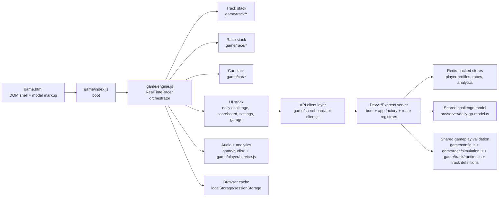

# Mini Racer System Change Map

## Purpose

This file is the fastest way to answer three product questions before a change starts:

1. What part of the product owns this behavior?
2. What else will this change affect?
3. Which files usually need to be touched?

## Scope And Assumptions

- This map covers the shipped game flow in `game.html`, `game/`, and `src/server/`.
- It also calls out supporting tools under `tools/` when they matter to analytics or content operations.
- It is written for planning and scoping, not as a line-by-line engineering spec.
- Shared gameplay logic matters more than folder ownership. Several "frontend" changes also affect server validation.

## System At A Glance

## What Talks To What

### Boot And Runtime Ownership

- `game.html` provides the full DOM contract: canvases, HUD, overlays, settings modal, garage modal, results modal, and playlist modal.
- `game/index.js` boots the app and instantiates `RealTimeRacer`.
- `game/engine.js` is the top-level orchestrator. It creates the feature modules, owns current run state, and wires together UI, simulation, track rendering, audio, storage, and network flows.
- The static track and the moving car use separate canvas layers. Devvit's Android client keeps the track layer on the main thread because its embedded WebView can expose the worker APIs without reliably presenting that canvas; iOS and web clients retain the worker renderer when supported.

### Gameplay Loop

- `game/race/simulation.js` updates the car position, speed, steering response, checkpoint progress, finish detection, and wall-impact response. The car uses an oriented capsule collision body covering its nose, center, and rear; impact speed comes from velocity at the body contact point, including rotation. Every inward wall impact resolves the full corner contact set to the safe side of the barrier and becomes a momentum-losing scrape, including severe head-on impacts. Continuous contact cannot retrigger scrape feedback until the car separates.
- `game/race/engine-methods.js` is the gameplay controller layer around simulation: start sequence, reset logic, timer flow, replay recording, checkpoint handling, and render-side helpers.
- `game/ghost/pb-ghost.js` is the isolated client playback/rendering feature. It interpolates the server-issued 20 Hz trace, freezes the selected ghost for the duration of an attempt, draws a highly transparent collisionless copy of the player's currently selected car before the player car, and has no simulation dependency. `game/ghost/pb-ghost-service.js` owns the authenticated summary/full-ghost requests and cache.
- `game/track/geometry.js` owns the small point and line-intersection helpers shared by track definitions and race simulation. Physics code does not import these helpers through the broader game configuration.
- `game/track/catalog.js` is the lightweight source for track names, existence checks, the default track, and explicit Daily GP schedule order. Metadata-only consumers should use it instead of loading full track geometry.
- `game/track/definitions/*` contains one geometry module per track. `game/track/tracks.js` assembles those modules into the compatibility `TRACKS` registry used by rendering, collision, replay validation, and other geometry consumers.
- `game/track/runtime.js` turns track shapes into smoothed geometry and collision segments.
- `game/track/assets.js` caches geometry, runtime collision data, and rendered track canvases.
- `game/track/engine-methods.js` owns track loading, resize behavior, and track presentation refresh.
- Track creation and integration steps are documented in `docs/track-authoring.md`.
- Local development exposes the deterministic gameplay state and time-step helpers through `window.__RACER_DEBUG__` plus the standard `render_game_to_text` / `advanceTime` browser-game test contract; hosted builds remove those hooks.

### UI And Modal Flow

- `game.html` contains the modal markup and the IDs/classes the UI modules depend on.
- `styles.css` is the single ordered stylesheet manifest loaded by the game. Its
  product-oriented partials cover gameplay screens, reusable sheets, garage,
  settings, playlist, standings and result states; their ownership and
  cascade-preservation rules are documented in `docs/css-architecture.md`.
- `game/race/ui-modal-shell.js` controls which modal view is open, focus trapping, pause/win/notice mode switching, and modal-to-garage handoff. Wall contact no longer has a terminal result screen. Active menus use shared spatial keyboard navigation; the `is-menu-selected` cue appears only after a directional key, while Enter still activates the preferred action beforehand.
- `game/race/ui-start-overlay.js` owns the lobby start overlay and uses the same spatial keyboard navigation while no sheet is open on top. Enter defaults to Start Race without a visible cue until a directional key is used.
- `game/ui/menu-keyboard-nav.js` is the shared geometry-based menu navigator used by lobby, pause, finish, garage, settings, Tracks, Standings, and the share dialog. Arrow keys and WASD move to the nearest active control in the requested on-screen direction; overlapping control bounds keep wide actions reachable from narrower menu items. Garage and Settings dismiss buttons are intentionally excluded because Escape owns dismissal, and Settings exposes the delay minus/plus buttons instead of selecting the meter display.
- `game/race/ui-modal-content.js` builds the result modal content blocks and score displays.
- `game/ui/reusable-modal.js` and `game/ui/modal-handoff.js` provide shared modal behavior used by settings, garage, playlist, and some results flows.

### Daily Challenge And Leaderboard Flow

- `game/daily-challenge/service.js` fetches the active challenge, playlist, snapshots, and daily result submission state.
- `game/daily-challenge/ui.js` renders the start screen card, playlist modal, preview canvas, and challenge summary state, including local submission stages like submitting, verifying, retrying, and terminal errors.
- `game/scoreboard/service.js` fetches leaderboard snapshots and submits best times.
- `game/scoreboard/snapshot.js` owns the shared client-side snapshot shape, row/time normalization, empty state, and mutation-safe cache cloning used by both scoreboard and Daily GP flows.
- `game/scoreboard/engine-methods.js` handles deferred verification and retry behavior after a local best run is recorded.
- Daily leaderboard PBs remain challenge-specific. The HUD, result deltas, medals, track cards, and PB ghost use the separate lifetime best for the selected track. A strictly faster server-verified track result replaces that track PB and becomes the ghost on the next attempt.
- Custom-post startup resolves the playable challenge before dismissing the loading screen and prepares that challenge's PB ghost as an initial race asset. A still-valid historical post therefore loads its historical track ghost, while an expired post resolves to the current featured challenge and loads today's ghost. The first `Race Now` start preserves this prepared asset instead of clearing and preparing it again; restarts continue reusing the same frozen record.
- PB ghost playback uses the same interpolated render timestamp as the live car. It does not render directly from the 60 Hz fixed-step clock, so uneven or higher-refresh display frames cannot expose the ghost as repeated positions followed by jumps.
- Tracks-to-race handoff hides the lobby immediately, resets the selected track without restoring the start overlay, and starts the countdown without awaiting the PB ghost request. Ghost playback freezes when the countdown completes, allowing a response received during the countdown to join that attempt without making network latency visible as a home-screen flash.
- `game/race/ui-modal-shell.js` owns the shared result-confirmation UI used by both the finish screen and daily standings. `game/daily-challenge/service.js` sends preview and confirm requests; the browser never composes the public comment itself.
- `game/storage.js` fetches player bootstrap state and falls back to local data when needed.
- Daily GP track selection walks the explicit `TRACK_SCHEDULE_KEYS` order from `game/track/catalog.js`, one track per day, using the most-recent published day as the playhead; `src/server/daily-gp-store.ts` persists each new day to the `dailygp:challenges` Redis ledger (first-writer-wins) so past days never change.
- Published Daily GP playlist rows come from server-side challenge history, not from recalculating old dates against the current track file.
- Explicit mock modes and standalone preview pages use a local mock challenge (`DEFAULT_TRACK_KEY`, or a track forced via `?mockDaily=<trackKey>`); normal local game runs use `/api/daily/*` or Devvit post data so they match the server-published track.
- Daily labels are calendar-based: `Today` is used only when a challenge's stored UTC date matches the current UTC date. Opening an older Reddit post keeps that post's challenge active and playable, but its Tracks and standings labels continue to show the original date.
- Moderator analytics "Players" and leaderboard entries measure different outcomes. Analytics counts a player after any accepted analytics event, while the leaderboard only gains a row after a finished run passes server replay validation and is accepted.
- Client analytics intentionally emit only six lifecycle events: game opened, game closed, playtime chunks, race started, race ended, and race restarted. Retired pageview, player-type, map-selection, menu, support, and mode-selection scaffolding is not part of the product contract.
- `leaderboardEntryCount` is the number of players with accepted times. `totalCount` can be larger because it may include the subreddit member total; the UI renders the difference as `No time yet` community placeholders, not as missing player scores.
- Daily leaderboard snapshots are persisted separately in each client's local storage for fast initial rendering. Opening a standings day shows its cached snapshot immediately, then force-refreshes that day from the server once per open standings session; closing and reopening standings starts a new session and refreshes again, while switching back to a day already refreshed in the same session reuses that server result. When a retained mobile WebView becomes visible again, the current challenge is marked stale: visible standings refresh immediately, while closed standings refresh on their next open. Submission responses include `improved`: a valid slower replay returns `accepted: true, improved: false` and causes no standings request, while `improved: true` force-refreshes only the submitted challenge after any older request for that challenge finishes. The last confirmed snapshot remains in memory and local storage until a successful refresh replaces it; while the selected day is refreshing, its cached rows stay readable with a compact header spinner, and a network failure only removes that spinner.
- The full standings modal requests scored racers in 50-row rank pages. `/api/daily/snapshot` and `/api/scoreboard/snapshot` accept `offset` plus `limit` and return `pageOffset`, `pageLimit`, `hasMore`, and `nextOffset`; scrolling near the end loads and appends the next page. Only the first page is persisted in the daily snapshot cache, while later pages are request-keyed by challenge, offset, and limit.
- Standings entry points open that selected-day modal directly. The date rail and touch swipe navigation switch available days inside it; there is no intermediate standings track-picker. The separate Tracks playlist remains the race-selection flow.
- Player standing is independent of loaded pages: every snapshot resolves `playerRank` and `currentPlayerRow`, and the standings header keeps that rank and best time visible even when the player's row is outside the loaded rank range.
- On touch devices, the standings list accepts deliberate horizontal swipes as an alternative to the day rail: swipe left for an older available day and right for a newer one. The original date strip remains visible, tappable, and horizontally scrollable; swipe navigation does not replace it. Short or vertically dominant gestures, day buttons, links, and the shareable player row keep their existing tap/scroll behavior.

### Server And Shared Validation

- `src/server/index.ts` is the production boot entrypoint only. It creates the
  Devvit server from `src/server/server-app.ts`, whose import-safe app factory
  installs the JSON middleware and registers capability-specific modules under
  `src/server/routes/`.
- Player, competition, sharing, analytics, moderator-menu, and scheduler routes
  are registered separately. Route modules own HTTP parsing and responses, while
  `src/server/server-app.ts` only wires their dependencies.
- `src/server/request-context.ts` is the single adapter for request-scoped
  Devvit identity, subreddit, post, and rate-limit context.
- Focused workflow modules own the server behavior outside HTTP: post-bound
  challenge resolution, community context, daily autopost persistence and post
  creation, moderator authorization, and moderator analytics-post lifecycle.
  These workflows use the existing Daily GP stores and sharing services without
  changing their Redis keys or public contracts.
- `src/server/daily-gp-model.ts` defines the challenge schedule, IDs, playable window, and Redis key model.
- `src/server/daily-gp-store.ts` persists generated challenge records, player profiles, durable player preferences, snapshots, and accepted runs. Player profiles use derived per-player Redis keys with independent 180-day expiration. A new guest profile is claimed once with an atomic Redis write; every later bootstrap, preference update, identity update, personalized snapshot, and submission requires the matching signed guest token. Public snapshots remain available without a token but do not expose or refresh player-specific state. If a browser loses its token, startup rotates only the guest identity and retries once while preserving local preferences and run data. The retired shared profile hash is not read or migrated, preventing stale records from replacing current preferences. The published challenge history hash uses the same TTL as the installed Devvit server.
- `src/server/pb-ghost-store.ts` persists one compressed lifetime PB record per player and track, separate from the 45-day daily leaderboard. Signed-in records have no app TTL; guest records follow the existing rolling 180-day retention. A track-geometry fingerprint plus simulation revision invalidates incompatible PBs. Existing retained strict-replay daily results lazily seed time and checkpoint data, with no ghost until a later verified improvement.
- Guest submission throttling is independent of the signed guest profile ID: the submit route hashes Devvit's server-provided LOID, falling back to the Reddit user ID, and uses that stable request identity for guest rate limits. Signed-in Reddit players remain throttled by canonical account identity, and guests fall back to their authorized profile ID only when Reddit provides neither request identifier.
- Daily GP submission transactions watch the submitting player's existing Redis lock, not the shared leaderboard keys, so different players can commit concurrently. The server returns `accepted: true` only after `EXEC` returns a non-empty result; an empty or missing result becomes a retryable `503`, and the browser keeps the replay in its local verification queue.
- `src/server/community-member-count.ts` reads the public `subscribersCount` through Reddit's community-info API and caches it in Redis for five minutes. Standings use accepted leaderboard entries when Reddit does not return a usable count.
- `game/shared/daily-gp-history-backfill.js` isolates the June 2-11, 2026 published-history seed used to backfill the server history store.
- `src/server/replay-validator.ts` replays submitted inputs against shared track/physics logic before the server accepts a run.
- Replay validation also samples the verified server simulation at 20 Hz and records an exact finish pose. Ghost traces are capped at 4,000 samples and 128 KB; the submitted client replay is never used directly for rendering.
- `src/server/daily-gp-post-store.ts` keeps one canonical Daily GP post record per subreddit and challenge day. New post creation does not report success until `src/server/daily-gp-share.ts` has created and pinned that post's score thread; lazy repair is reserved for historical posts created before this contract. The share service validates finish replays or reads the verified standings best, generates the exact comment, and submits player comments only as replies to that score thread after confirmation.
- Share previews expire after 10 minutes. Successful shares are idempotent by subreddit, challenge, Reddit user, and exact time for 45 days; a deleted comment clears that stale record and can be shared again. User attribution is checked after submission and a mismatched app-authored fallback is deleted.
- Important implication: track geometry, finish/checkpoint logic, wall-scrape response, and physics tuning are not frontend-only. The server uses the same contracts.

## Major Areas And Their Responsibilities

| Area | Main files | Owns | Depends on |
| --- | --- | --- | --- |
| Boot shell | `game.html`, `game/index.js` | Page structure and app startup | `game/engine.js`, `styles.css` |
| Runtime orchestrator | `game/engine.js` | State ownership and feature wiring | Almost every `game/*` feature module |
| Track system | `game/track/catalog.js`, `game/track/definitions/*`, `game/track/tracks.js`, `game/track/geometry.js`, `game/track/runtime.js`, `game/track/assets.js`, `game/track/engine-methods.js` | Lightweight metadata and schedule order, per-track geometry, collision, cached canvases, presentation | `game/config.js`, `game/track/presentation.js` |
| Race/physics | `game/race/simulation.js`, `game/race/engine-methods.js`, `game/car/handling.js` | Driving feel, wall scrapes, optional collision auto-restart, finish logic, replay capture | Track runtime, config, HUD, modal flow |
| Personal-best ghost | `game/ghost/pb-ghost.js`, `game/ghost/pb-ghost-service.js`, `src/server/pb-ghost-store.ts`, `src/server/pb-ghost-trace.ts` | Lifetime per-track PB state, verified trace generation, playback, selected-car rendering | Replay validator, player identity, Redis, settings |
| Car visuals/customization | `game/car/sprite.js`, `game/car/player-car-skin.js`, `game/car/player-trail.js`, `game/settings/garage-ui.js` | Car art, asset loading, garage selection, trail style | `public/assets/cars/*`, generated asset list, local cache, Redis player profile |
| Daily challenge | `game/daily-challenge/service.js`, `game/daily-challenge/ui.js`, `game/daily-challenge/storage.js` | Featured challenge state, playlist, local bests | Shared schedule, server APIs, preview renderer |
| Leaderboards | `game/scoreboard/service.js`, `game/scoreboard/snapshot.js`, `game/scoreboard/ui.js`, `game/scoreboard/engine-methods.js` | Snapshot normalization, paginated standings display, submissions, verification retry flow, share entry point | API routes, daily challenge storage, server APIs |
| Settings | `game/settings/ui.js`, `game/settings/*.js`, `game/player/preferences.js` | Identity, audio toggles, collision auto-restart and delay, durable preference sync | Browser cache, player APIs, Redis profile, modal helpers |
| Audio/analytics | `game/audio/*`, `game/player/service.js` | Sound playback and analytics events | Settings preferences, `/api/analytics/event` |
| Server | `src/server/index.ts`, `src/server/server-app.ts`, `src/server/routes/*`, focused workflow modules, `src/server/daily-gp-store.ts`, `src/server/daily-gp-share.ts` | Server boot, HTTP contracts, Reddit workflows, persistence, validation, scheduling, canonical posts and result comments | Redis, Reddit API, shared gameplay modules |

## API Surface

These client-facing routes are registered under `src/server/routes/`:

- `/api/player/bootstrap`
- `/api/player/identity`
- `/api/player/preferences`
- `/api/player/track-pbs`
- `/api/player/pb-ghost`
- `/api/scoreboard/snapshot`
- `/api/daily/active`
- `/api/daily/playlist`
- `/api/daily/snapshot`
- `/api/daily/submit`
- `/api/daily/share/preview`
- `/api/daily/share/confirm`
- `/api/analytics/event`
- `/api/analytics/summary`

The browser-side API route and player identity entrypoint is `game/scoreboard/api-client.js`. Both leaderboard snapshot endpoints normalize their responses through `game/scoreboard/snapshot.js` before UI or cache use.

## Dependency Inventory

### Runtime Product Dependencies

| Dependency | Why it exists | Where it matters |
| --- | --- | --- |
| `@devvit/web`, `@devvit/redis` | Reddit/Devvit server runtime, context, Redis, shared request types, and posting flows | `src/server/*`, Devvit post/menu flows |
| `express` | API routing and import-safe app creation inside the Devvit server | `src/server/server-app.ts`, `src/server/routes/*` |

### Product-Adjacent Dependencies

| Dependency | Why it exists | Where it matters |
| --- | --- | --- |
| `chart.js` | Moderator analytics dashboard charts | `mod-tool.js` |
| `flatpickr` | Date selection for moderator analytics | `mod-tool.js` |

### Build And Quality Dependencies

| Dependency | Why it exists | Where it matters |
| --- | --- | --- |
| `@devvit/start` | Devvit integration for the Vite build | `vite.config.js` |
| `devvit` | Local Devvit CLI for playtest, upload, and publish workflows | `package.json` scripts, `devvit.json` |
| `vite` | Build and local packaging | `vite.config.js` |
| `vitest` | Test runner | `vitest.config.js`, `npm test` |
| `@stryker-mutator/*` | Mutation testing | `stryker.config.mjs` |
| `tailwindcss`, `@tailwindcss/cli` | Analytics dashboard CSS build, not main gameplay styling | `tools/analytics-dashboard.tailwind.css` |

## Change Impact Matrix

Use this table when scoping work. "Primary files" are the places most likely to change. "Review too" means likely ripple checks even if no edit is needed.

| Change request | Primary files | Review too | Why this area ripples |
| --- | --- | --- | --- |
| Car skin or new car art | `public/assets/cars/*`, `tools/generate-player-car-assets.js`, `game/car/generated-player-selectable-car-assets.js`, `game/car/sprite.js`, `game/car/player-car-skin.js`, `game/settings/garage-ui.js` | `styles.css`, `game.html` | New art affects asset discovery, garage options, and fallback loading |
| Car trail options | `game/car/player-trail.js`, `game/settings/garage-ui.js` | `styles.css`, `game/engine.js`, `game/player/preferences.js` | Trail choices are cached locally, persisted in the Redis player profile, and rendered from engine state |
| Car size or render look | `game/config.js`, `game/car/sprite.js`, sometimes `public/assets/cars/*` | `game/race/engine-methods.js`, `styles.css` | Car scale is visual, but shadow and draw sizing live in config/orchestrator flow |
| Car handling / physics tuning | `game/car/handling.js`, `game/config.js`, `game/race/simulation.js` | `src/server/replay-validator.ts`, `game/race/run-policy.js`, `game/race/engine-methods.js` | Server validation reuses shared gameplay logic, so tuning changes affect accepted runs |
| Collision rules, win rules, checkpoint behavior | `game/race/simulation.js`, `game/race/run-policy.js` | `src/server/replay-validator.ts`, `game/daily-challenge/engine-methods.js`, `game/race/result-flow.js` | Scrape and finish logic drive both local UX and server acceptance |
| Track layout or new track | `game/track/definitions/*`, `game/track/catalog.js`, `game/track/tracks.js`, and `game/track/runtime.js` only if geometry handling changes | `game/medals/medal-times.json`, `game/track/presentation.js`, `src/server/daily-gp-store.ts`, `docs/track-authoring.md` | Geometry drives gameplay and replay validation, while catalog order independently controls future Daily GP scheduling and metadata |
| Personal-best ghost behavior | `game/ghost/*`, `src/server/pb-ghost-store.ts`, `src/server/pb-ghost-trace.ts` | `game/daily-challenge/engine-methods.js`, `game/scoreboard/engine-methods.js`, `src/server/replay-validator.ts`, settings and route tests | Daily improvement and lifetime track improvement are separate contracts; geometry or simulation revisions intentionally reset incompatible track PBs |
| Track visual treatment only | `game/track/presentation.js`, `game/track/canvas.js`, `styles.css` | `game/daily-challenge/ui.js`, `game/race/ui-modal-shell.js`, `game/track/preview-renderer.js` | One presentation system feeds race view, previews, and modal thumbnails |
| Daily challenge schedule or availability window | `game/track/catalog.js`, `src/server/daily-gp-model.ts`, `src/server/daily-gp-store.ts`, `game/daily-challenge/service.js` | `src/server/post-bound-challenge.ts`, `README.md` if player-facing behavior changes | New challenge generation walks explicit `TRACK_SCHEDULE_KEYS`; playlist availability reads persisted published history so past days do not shift |
| Start screen or daily card copy/layout | `game/daily-challenge/ui.js`, `game.html`, `styles.css` | `game/daily-challenge/service.js` | The UI is driven by API summary fields and modal launch actions |
| Leaderboard snapshot or submit behavior | `game/scoreboard/service.js`, `game/scoreboard/snapshot.js`, `game/scoreboard/ui.js` | `src/server/routes/competition-routes.ts`, `src/server/daily-gp-store.ts`, `src/server/community-context.ts`, `game/scoreboard/engine-methods.js` | Client display and server payload shape must stay aligned; community size and submission rate-limit identity come from trusted server context |
| Result sharing or score-thread behavior | `game/race/ui-modal-shell.js`, `game/daily-challenge/service.js`, `src/server/daily-gp-share.ts`, `src/server/daily-gp-post-store.ts` | `src/server/daily-post-service.ts`, `src/server/routes/share-routes.ts`, `devvit.json`, finish and standings tests | The same confirmation contract serves finish and standings; Reddit user-action permission and post/comment identity are server-enforced |
| Modal redesign or modal flow changes | `game.html`, `styles.css`, `game/race/ui-modal-shell.js`, `game/race/ui-modal-content.js` | `game/ui/reusable-modal.js`, `game/ui/modal-handoff.js`, `game/settings/ui.js`, `game/settings/garage-ui.js`, `game/daily-challenge/ui.js` | There is one shared modal language, even though multiple features use it differently |
| Settings changes | `game/settings/ui.js`, specific `game/settings/*.js` preference files, `game/player/preferences.js` | `game/storage.js`, `src/server/daily-gp-store.ts`, `game.html`, `styles.css` | Settings use browser storage as a cache and the independently expiring Reddit Redis player profile as the durable source |
| Audio changes | `game/audio/*`, `game/settings/car-audio-preference.js`, `game/settings/music-preference.js` | `game/engine.js`, `game/settings/ui.js` | Audio lifecycle is tied to user gesture handling and settings state |
| Replay verification / anti-cheat changes | `src/server/replay-validator.ts`, `game/race/simulation.js`, `game/track/runtime.js`, `game/config.js` | `src/server/daily-gp-store.ts`, `game/scoreboard/engine-methods.js` | This is the highest-risk area because client and server must stay logically identical |
| Analytics event changes | `game/player/service.js`, `src/server/analytics-store.ts` | `tools/analytics-dashboard.js`, `tools/analytics/schema.sql` | New event dimensions often need both collection and reporting updates |
| Moderator workflows, daily autoposting, or public post discovery copy | `src/server/daily-post-service.ts`, `src/server/moderator-access.ts`, `src/server/moderator-analytics-post.ts`, `src/server/reddit-post-title.ts` | `src/server/routes/internal-routes.ts`, `README.md`, `CHANGELOG.md`, route/workflow tests | These flows are server-owned and tied to Devvit/Reddit context; the outer post title and text fallback are the public search and Reddit Answers surfaces |

## High-Risk Shared Contracts

These are the places where a "small" change can create regressions outside the visible screen:

1. `game/race/simulation.js`
   Changes driving feel, wall scrapes, checkpoints, finish detection, and replay outcomes.
2. `game/track/definitions/*` and `game/track/catalog.js`
   Definitions change race geometry, previews, and replay validation. Catalog order changes which tracks are eligible for future Daily GP publication.
3. `game/track/runtime.js`
   Changes collision smoothing and collision segment generation for both client and server.
4. `game/config.js`
   Changes baseline physics and render-related car constants used broadly across runtime behavior.
5. `src/server/daily-gp-model.ts`
   Changes challenge lifecycle, generated challenge shape, Redis key strategy, and scheduling rules.

## Secondary Tooling Areas

These are useful, but they are not on the critical player path:

- `mod-tool.html`, `mod-tool.js`, `mod-tool.css`
  Shipped moderator analytics UI and reporting support.
- `tools/mapmaker.*`
  Track/content support tooling. Local **Save & Integrate** writes the selected
  definition and updates the catalog, schedule, and compatibility registry;
  new tracks append to the schedule by default. Manual module and integration
  exports remain available as fallbacks, as described in
  `docs/track-authoring.md`.
- `tools/runner.*`
  Auxiliary workflow tooling.
- `preview.html`, `preview.js`, `preview.css`
  Custom Reddit post preview entrypoint and standalone local review surface. The current challenge is labeled `Today`; the preview shows its gold-medal threshold and shared gold medal artwork, and draws the stock in-game car clearly past the start line with a short trail. In-game schematic previews do not use that post-only treatment.
- `mod-tool.*`
  Moderator/support tooling outside the main race runtime.

## Recommended Scoping Heuristic

Before approving any new request, sort it into one of these buckets:

- Visual-only
  Mostly `game.html`, `styles.css`, and UI modules.
- Gameplay-only
  Mostly `game/race/*`, `game/car/*`, `game/track/*`, plus server validation review.
- Data/API
  Mostly `game/*/service.js` and `src/server/*`.
- Cross-cutting
  Anything touching tracks, physics, challenge rules, or replay validation.

If a request lands in the cross-cutting bucket, plan for both gameplay validation and leaderboard acceptance checks before calling it complete.

For visual changes, use `docs/css-architecture.md` to identify the owning
stylesheet while preserving the manifest's documented cascade order.
